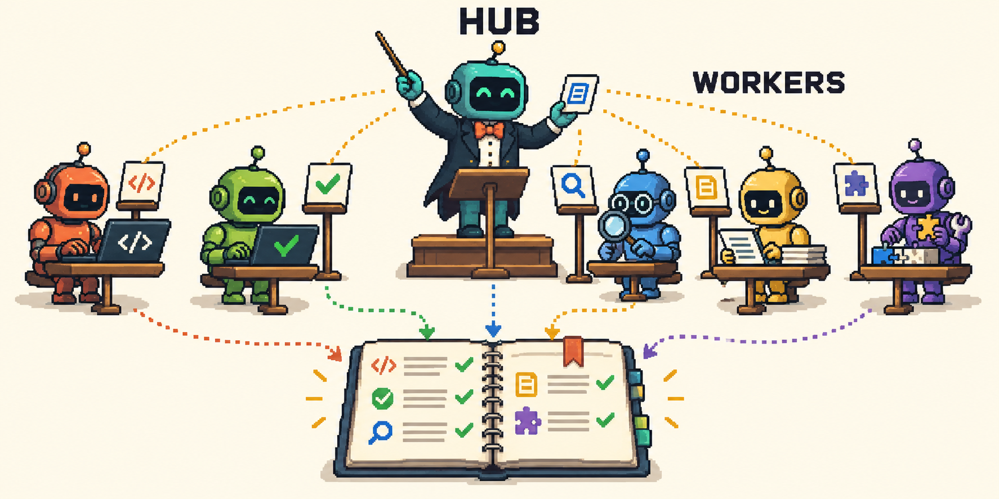

# agent-hub

Keep long-running coding work moving across chat sessions with Claude Code or Codex.

**Ask your agent first:** [Should we install this? Agent guide →](docs/agents/README.md#assess-fit-before-installing)

## Is it for you?

Install it when work needs to continue across chat sessions, you need to manage several workers
by role, or you want recorded decisions and a handoff for the next coordinator.

It gives you:

- **Workers you can reach later:** start from a brief, check progress, message or resume by role.
- **Shared memory for the work:** journals, inboxes, owner questions and handoff files.
- **Coordination for shared resources:** locks on protected branches and shared environments.
- **A progress view:** `agent-top` in a terminal for both engines; a live pane in Claude Code.

Skip it for a small task one session can finish, or when built-in subagents already cover your needs.
It runs locally for **one person on one machine**.



## Start

1. **Install for your host.** On macOS or Linux, with Python and the selected CLI available:

   **Claude Code** (2.1.287+; Python 3.10+), in its chat:

   ```text
   /plugin marketplace add ilya-kozyrev/claude-agent-hub
   /plugin install agent-hub@claude-agent-hub
   ```

   Confirm `/agent-hub:hub` is available after installation. [Installation and permissions →](docs/install.md)

   **Codex** (Python 3.11+): [clone, install and trust hooks →](docs/codex.md#install-in-codex).

   Detached workers default to broad permissions. Review the linked permission settings before launching them.

2. **Set up your project.** Open your repository in the chosen host and ask:

   ```text
   Use agent-hub:setup for this repository.
   ```

3. **Give the hub a job.** In Claude Code, start with `/agent-hub:hub`; in Codex, ask to use
   `agent-hub:hub`. For example:

   ```text
   Use agent-hub:hub to plan a stage called csv-export: add CSV export to the reports page.
   Wait for my approval of the plan. Stop at open PRs with green CI; ask before merging.
   ```

Answer open decisions and approve the plan. Check progress with `/agent-top` in Claude Code,
or ask the hub to run `agent-top --once`. [Use your own terminal →](docs/install.md#what-installing-changes)
The hub tells you when results need your attention.

## Read more when you need it

- [For agents: assess fit, operate, or contribute](docs/agents/README.md)
- [Getting started: a human walkthrough](docs/getting-started.md)
- [Codex setup and engine differences](docs/codex.md)
- [Commands, configuration and limits](docs/reference.md)
- [Monitoring and screenshots](docs/monitoring.md)
- [Why use a hub?](docs/why.md) · [Comparison with built-in facilities](docs/comparison.md)
- [Architecture](docs/architecture.md) · [Launch choices](docs/launch-modes.md) · [Reviewers](docs/reviewers.md)
- [Roadmap](ROADMAP.md) · [Changelog](CHANGELOG.md) · [Contributing and tests](docs/agents/contributing.md)

MIT — [License](LICENSE).
