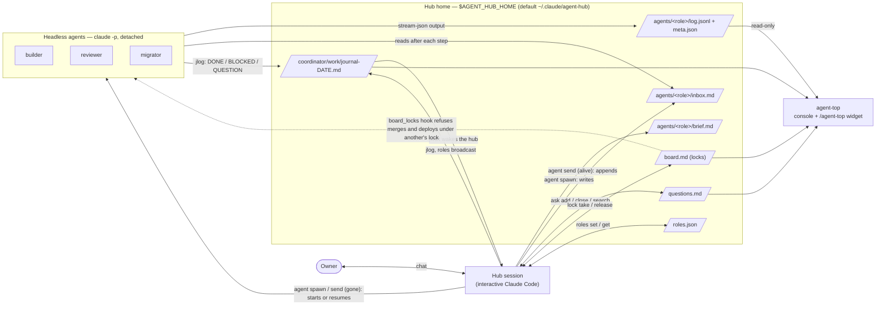
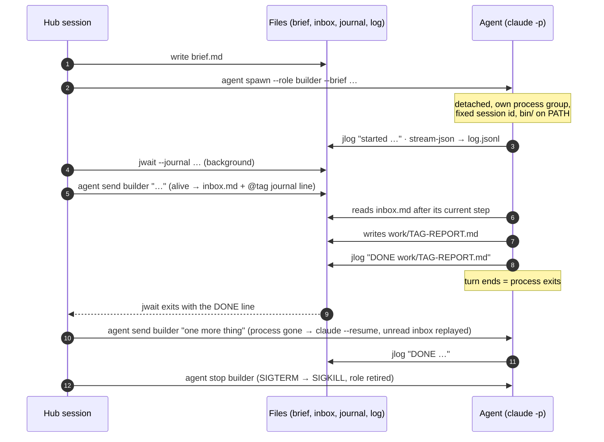
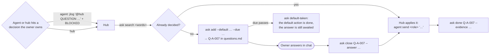

# agent-hub

A Claude Code plugin for running long, parallel work with **one hub session and many headless agents**.

The hub is your interactive Claude Code session. It writes a brief, starts a detached `claude -p` agent for it, and
goes back to planning. Agents report through a shared **journal**, take messages through an **inbox**, ask the owner
through a **question register**, and respect **locks** on shared resources such as merging to main. When the hub's
context fills up, it writes a **handoff** and a fresh hub takes over — the agents keep running. `agent-top` shows
all of it at a glance, in the terminal or as a chat widget.

Everything is plain files under one directory and a handful of small Python CLIs. No server, no database.

New here? Start with [Getting started](docs/getting-started.md) — from an idea to merged code in eleven steps.

## Why

A single chat session is a poor place to run a week of work:

- **Long sessions get slower, worse and more expensive.** Claude Code sends the whole conversation with every request,
  so each turn costs as much as the history behind it. In one project 16 % of a coordinator's turns were pipeline
  polls, each re-reading 300–600k tokens of context.
- **Subagents work within one session.** They are the right tool for a search or a log read, but they report only to
  the session that spawned them, into its context. Work that runs for hours, must outlive the session or must
  be reachable by others goes to a headless `claude -p` agent that reports one journal line per event.
- **`/compact` is a summary you do not choose.** A handoff is a short file with a fixed structure, written before the
  context is full and readable by a person and by the next session; decisions, questions and locks live in files.

```
 BEFORE: one session does everything              AFTER: the hub plans, agents work, files remember

 ┌───────────────────────────────┐                ┌──────────────┐  brief   ┌──────────────────┐
 │ chat session                  │                │  hub session │ ───────▶ │ agent: builder   │ claude -p,
 │  plan + build + test + review │                │  (plans,     │ ◀─────── │ agent: reviewer  │ detached,
 │  + logs + merge + questions   │                │   decides)   │  journal │ agent: migrator  │ survives the hub
 │  … context full, work stalls  │                └──────┬───────┘          └────────┬─────────┘
 └───────────────────────────────┘                       │   journal · inbox · questions · locks │
                                                         └──────────── files on disk ─────────────┘
                                                 a new hub reads the handoff and takes over; agents keep going
```

The full argument, with numbers and a comparison with Claude Code's own subagents and `/compact`:
[Why a hub and headless agents](docs/why.md).

## How it works



| Tool | What it does |
|---|---|
| `agent spawn / status / send / stop` | Start a detached `claude -p` agent from a brief; check it; message it (inbox while alive, resume after exit); stop it. |
| `jlog` | Append `- HH:MM [tag] text` to today's stage journal. |
| `jwait` | The only waiter: block (in the background) until new journal or log lines match, or until an alarm time. |
| `roles` | Who plays which role, by full session id; cross-session send budget; broadcast. |
| `ask` | The owner-question register: questions with a default action and a due time, answers, decisions taken by agents. |
| `lock` | The lock board: `deploy-window`, `main-merge`, `stage`, `migration-head`. |
| `hub takeover / handoff` | Hand a hub shift over in one command each. |
| `nightq` | A night queue with a permission matrix, for work that may continue while the owner sleeps. |
| `agent-top` | Live console of all agents (curses), `--once` text, `--json`, `--widget` HTML. |

More diagrams and the file formats: [docs/architecture.md](docs/architecture.md).

## Screens

`agent-top --once` (synthetic demo data, `docs/render_demo.sh`):

```text
 agent-top ● 2 ✓ 1 ✗ 1 stage-a · locks 1 · questions 1 (overdue 1) · limit 5h 34% 7d 52%                       14:01:17
  ROLE      TASK                           STATUS MODEL           AGE TURN  CTX     $ ✉  NOW / LAST
● builder   Rebase payments and get CI gr… live   opus-5-5/hi      0s    6  94k     — ✉1 ▸ Bash: run the full test suit…
● reviewer  Review PR #41 (export to Parq… live   sonnet-5-5/hi    0s    2  62k     —    ▸ Read: /work/webapp/src/expor…
✗ migrator  Rehearse migration 0042 on a … error  opus-5-5/hi     20m    1  62k $1.92    Dry-running the migration on a…
✓ docs      Update the API docs for the e… done   sonnet-5-5/hi   14m    1  62k $0.84    DONE docs updated, report at w…

Locks (lock list)
  main-merge webapp until 2026-10-02 14:01 — Hub stage-a #3: stage hub merges main

Owner questions (ask summary)
  stage-a — open 1, overdue 1
    Q-A-001 [stage-a] open OVERDUE — Turn the new export on by default?
    blocks: the release; default by 2026-09-30T12:01: ship with the flag off

Journal (last 5 lines):
13:09 [hub-3] start: "Hub stage-a #3" took over from "Hub stage-a #2"; locks: main-merge
13:11 [hub-3-builder] started headless agent builder (claude-opus-5-5/high)
13:41 [hub-3-migrator] EXIT migrator: error_max_turns, error; code 1, turns 80 — agent status migrator
13:46 [hub-3-docs] DONE docs updated, report at work/hub-3-docs-REPORT.md
14:00 [hub] @hub-3-builder after the suite, push and open the PR
```

Interactively, `agent-top` adds a live feed per agent (thoughts ✎, commands ▸, results ◂), its brief and inbox, the
journal with a filter, and `m` / `x` to message or stop an agent after a y/N prompt.

The `/agent-top` chat widget (a sketch of the HTML that `agent-top --widget` produces, same data):


## Install

Requirements: macOS or Linux, Python 3.10+ (standard library only), the `claude` CLI on `PATH`.

```text
/plugin marketplace add ilya-kozyrev/claude-agent-hub
/plugin install agent-hub@claude-agent-hub
```

> **Permissions.** Headless agents run with `--permission-mode bypassPermissions` by default: a `claude -p` run has
> nobody to approve a prompt, and any other mode silently stalls on the first blocked tool. Treat every agent as a
> process with your user's rights — say in its brief what it must not touch, run it in a worktree or sandbox, or set
> `AGENT_HUB_PERMISSION_MODE` (for example `acceptEdits`) and accept that some tools will be refused.

While the plugin is enabled its `bin/` is on the Bash tool's `PATH`, so Claude can call `agent`, `jlog`, `jwait` and the
rest directly. To use them in your own terminal too, add the plugin's `bin/` to your `PATH` or symlink the tools.

The plugin adds three skills — `hub` (the workflow), `handoff` and `agent-top` (invoked as `/agent-hub:agent-top`,
or `/agent-top` when no other skill has that name) — and three hooks: the lock-board guard, an owner-question line at
session start, and a size cap on `HANDOFF-*.md` files.

### Recommended companion: grilling

The hub settles open decisions with you before it writes any brief. It does that best with the `grilling` skill from
[mattpocock/skills](https://github.com/mattpocock/skills) (MIT): rounds of numbered questions, each with a recommended
answer, until nothing is left assumed. agent-hub does not bundle it; install it next to this plugin:

```text
/plugin marketplace add mattpocock/skills
/plugin install mattpocock-skills@mattpocock
```

Without it the `hub` skill grills by hand in the same format; the answers go to the question register either way.

## Quickstart

Ask Claude in any session to load the `hub` skill, or run the commands yourself:

```bash
export HUB_STAGE=stage-a                      # one directory per stream of work under the hub home

# 1. write a brief (template: templates/brief-executor-template.md) and start an agent
agent spawn --role builder --cwd ~/code/webapp --model sonnet --brief ./brief-builder.md

# 2. watch it
agent status builder                          # alive?, last event, turns, last line
agent-top                                     # live console; agent-top --once for a text snapshot

# 3. message it — alive: into its inbox; finished: the session resumes with the message
agent send builder "after the tests pass, open the PR"

# 4. wait for its status line without polling (run in the background from Claude)
jwait --journal --tag hub --match '\b(DONE|BLOCKED|EXIT|QUESTION)\b' --for 2h

# 5. stop it
agent stop builder
```

The agent's brief gets a footer that tells it how to talk back: `jlog "DONE <report path>"` when finished,
`jlog "@hub QUESTION …"` then `BLOCKED` when it needs an answer, and to read its inbox after every major step.

A full working day, step by step: [docs/a-day-with-agent-hub.md](docs/a-day-with-agent-hub.md).

## Agent lifecycle



If a run crashes or ends without a status word, a small wrapper journals `EXIT <role>: …` under the agent's tag, so
the hub's `jwait` wakes anyway.

## Owner questions



Every open question carries the action that happens if nobody answers by its due time, so work is never silently
stuck. A decision an agent takes on its own on a matter the owner normally decides is recorded with `ask decided` —
visible, contestable. At session start a hook prints one line per stage: open, overdue, awaiting execution.

## File layout

```text
$AGENT_HUB_HOME/                      default ~/.claude/agent-hub
├── board.md                          lock board (lock)
├── lock-rules.json                   optional: extra commands the lock hook guards
├── .jwait-state/<caller>.json        what each jwait caller has already seen
└── <stage>/                          one directory per stream of work
    ├── roles.json                    role → full session id, kind, tag; send counts
    ├── questions.md                  owner-question register (ask)
    ├── night-queue.md, night-log.md  optional night queue (nightq)
    ├── handoff-facts.sh              optional: prints environment rows for hub handoff
    ├── agents/<role>/                one headless agent
    │   ├── brief.md                  copy of the brief it was started with
    │   ├── inbox.md                  messages sent while it runs
    │   ├── log.jsonl                 stream-json of every run (spawn and resumes)
    │   ├── stderr.log
    │   └── meta.json                 session id, pid, model, effort, runs, unread messages
    └── coordinator/
        ├── HANDOFF-hub-<stage>-<date>.md
        └── work/
            ├── journal-YYYY-MM-DD.md one line per event: - HH:MM [tag] text
            └── <tag>-REPORT.md       agents' reports
```

## Configuration

| Variable | Default | Meaning |
|---|---|---|
| `AGENT_HUB_HOME` | `~/.claude/agent-hub` | The hub home above. |
| `HUB_STAGE` | `default` | Stage when `--stage` is not given. |
| `HUB_TAG` | from `roles` | Journal tag of the caller (set for agents automatically). |
| `AGENT_HUB_TZ` | local zone | IANA time zone of journal times and deadlines. |
| `AGENT_HUB_MODEL_MAP` | none | Pin aliases to model ids, e.g. `sonnet=claude-sonnet-…,opus=claude-opus-…`. |
| `AGENT_HUB_DEFAULT_EFFORT` | `high` | Effort for `agent spawn` without `--effort` (haiku gets none). |
| `AGENT_HUB_PERMISSION_MODE` | `bypassPermissions` | Permission mode of headless agents (nobody is there to approve a prompt). |
| `CLAUDE_BIN` | `claude` on PATH | The CLI to run agents with. |
| `AGENT_INIT_TIMEOUT` | `120` | Seconds to wait for a new run's init event before calling the spawn failed. |
| `AGENT_HUB_SEND_CAP` | `10` | Cross-session sends per sender before `roles` falls back to the journal. |
| `AGENT_HUB_NIGHT` | `23:00-08:00` | Night window for `nightq`. |
| `AGENT_HUB_HANDOFF_MAX_BYTES` | `15360` | Size cap of `HANDOFF-*.md` enforced by the hook. |
| `AGENT_BOARD_FILE`, `AGENT_HUB_LOCK_RULES` | in the hub home | Override the board and the lock-rules file. |

`lock-rules.json` teaches the lock hook your own commands, for example:

```json
{"protected_branches": ["main"],
 "rules": [{"match": "\\bmake deploy-prod\\b", "kinds": ["deploy-window"], "action": "production deploy"},
           {"match": "\\bhelm upgrade .* -n staging\\b", "kinds": ["stage"], "action": "staging rollout"}]}
```

Built in: `gh pr merge`, `glab mr merge`, merge calls through `gh api` / `glab api`, and `git push` to a protected
branch need `main-merge`. Add `# lock-ok: <reason>` to a command to pass it deliberately.

## Limitations

- macOS and Linux only (`fcntl`, process groups, `ps`). Python 3.10+, standard library only.
- The `claude` CLI must be on `PATH` (or set `CLAUDE_BIN`); on macOS the CLI bundled with Claude Desktop is a fallback.
- Headless agents run with `bypassPermissions` by default. Give every agent a brief that says what it must not
  touch, or set `AGENT_HUB_PERMISSION_MODE`.
- Roles of kind `desktop`, the send budget and `hub takeover --session local_…` read Claude Desktop's session metadata
  (macOS). Terminal sessions work too, as kind `cli`, but cannot receive cross-session messages — they read the journal.
- `sendPrompt` buttons do not work in the Claude Code desktop tab, so the `/agent-top` widget has no buttons; it names
  the commands to type instead.
- The night nudge (waking a silent coordinator at night) needs Claude Desktop's scheduled tasks; see
  [templates/night-nudge-task.md](templates/night-nudge-task.md).
- One machine: the files are local and the locks are advisory `flock`s plus a hook, not a distributed lock service.

## Tests

```bash
bash tests/run_all.sh
```

Every test runs with `HOME` and `AGENT_HUB_HOME` in throw-away directories and a stand-in CLI
(`tests/fake_claude.py`) instead of `claude`, so nothing touches your real hub home and no model is called.

## License

MIT — see [LICENSE](LICENSE).
