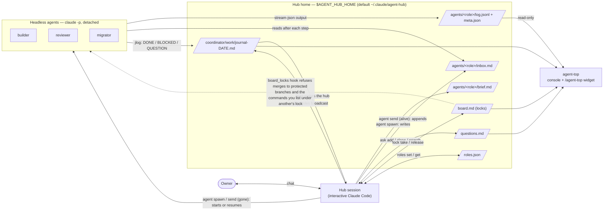
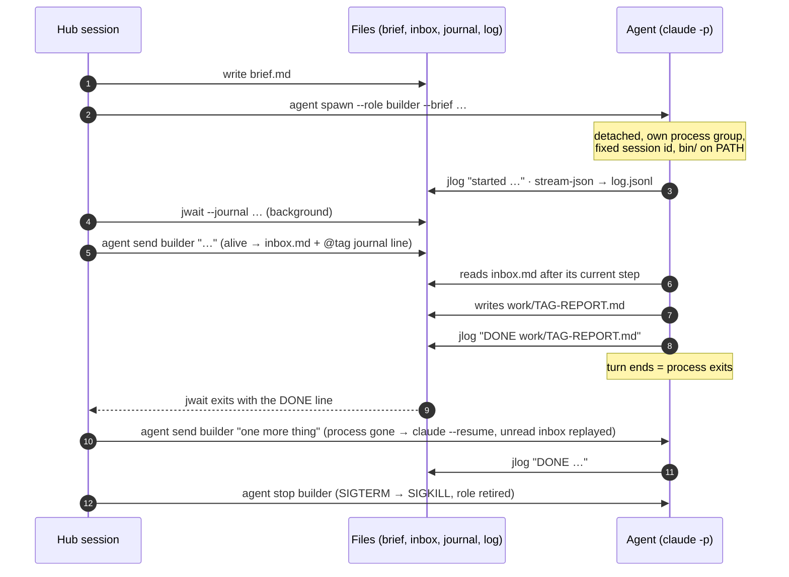

# agent-hub

A Claude Code plugin for running long, parallel work with **one hub session and many headless agents**.

The hub is your interactive Claude Code session. It writes a brief, starts a detached `claude -p` agent for it, and
goes back to planning. Agents report through a shared **journal**, take messages through an **inbox**, ask the owner
through a **question register**, and respect **locks** on shared resources such as merging to main. When the hub's
context fills up, it writes a **handoff** and a fresh hub takes over — the agents keep running. `agent-top` shows
all of it at a glance, in the terminal or as a chat widget.

Everything is plain files under one directory and a handful of small Python CLIs. No server, no database.

New here? Start with [Getting started](docs/getting-started.md) — from an idea to merged code in eleven steps.

## Why

A single chat session is a poor place to run a week of work:

- **Long sessions get slower, worse and more expensive.** Claude Code sends the whole conversation with every request,
  so each turn costs as much as the history behind it. In one project 16 % of the turns of a coordinating session were
  pipeline polls, each re-reading 300–600k tokens of context.
- **Subagents work within one session.** They are the right tool for a search or a log read, but they report to the
  session that spawned them, into its context. Work that runs for hours, must outlive the session or must be reachable
  by others goes to a headless `claude -p` agent that reports one journal line per event.
- **`/compact` is a summary you do not choose.** A handoff is a short file with a fixed structure, written before the
  context is full and readable by a person and by the next session; decisions, questions and locks live in files.

```
 BEFORE: one session does everything              AFTER: the hub plans, agents work, files remember

 ┌───────────────────────────────┐                ┌──────────────┐  brief   ┌──────────────────┐
 │ chat session                  │                │  hub session │ ───────▶ │ agent: builder   │ claude -p,
 │  plan + build + test + review │                │  (plans,     │ ◀─────── │ agent: reviewer  │ detached,
 │  + logs + merge + questions   │                │   decides)   │  journal │ agent: migrator  │ survives the hub
 │  … context full, work stalls  │                └──────┬───────┘          └────────┬─────────┘
 └───────────────────────────────┘                       │   journal · inbox · questions · locks │
                                                         └──────────── files on disk ─────────────┘
                                                 a new hub reads the handoff and takes over; agents keep going
```

The full argument, with numbers, and the case against `/compact` for long work:
[Why a hub and headless agents](docs/why.md).

## How it compares with Claude Code's own facilities

Claude Code can already run several things at once. What each one keeps for you differs; read the table, then pick the
lightest tool that covers your case. Every Claude Code cell is checked against the official docs (numbers in brackets,
links below); `—` means the docs do not say.

| | Outlives the session that started it | Another session can message it | Fixed session id | State is shared through | Locks on shared resources | Platform, status |
|---|---|---|---|---|---|---|
| **Sub-agent in a session** (also in the background) | — Works "within a single session"; a finished one is resumed by resuming that session. What a running one does when the session exits is not documented [1] | Only the session that spawned it (`SendMessage` by name or ID); it reports to that conversation [1][2] | An agent ID and optional name, valid inside the parent session [1] | Its final message goes into the parent's context; transcript on disk; optional per-agent `memory` directory [1] | — (optional `isolation: worktree` separates files) [1][11] | Built in [1] |
| **Background Bash task** (`run_in_background`) | No: cleaned up when Claude Code exits, detached children included (macOS, Linux); it keeps running only if you background the whole session [3] | No: a shell command, not an agent [2] | A task ID inside the session [3] | An output file Claude reads [3] | — | Built in; 30 min by default, 2 h at most per command [3][4] |
| **`claude -p --resume` by hand** | Yes: your own process; the conversation is stored and `--resume <id>` continues it [5][6] | Yes through cross-session messaging (v2.1.224+): a `-p` worker takes messages unattended if its `--settings` set `crossSessionInbound: accept`; not in `--bare` mode. Otherwise resume it with a new prompt [6][7] | `--session-id <uuid>` [5] | What you build: stdout, stream-json, files [6] | — | Wherever Claude Code runs [10]; `--max-turns`, `--max-budget-usd` [5] |
| **Background sessions** (`claude --bg`, agent view) | Yes: a supervisor process runs them after you close the terminal or start another session [8] | Yes: reply from agent view or `claude attach <id>`; reachable by cross-session messaging [7][8] | A short ID printed at start (`claude logs / attach / stop <id>`) [5][8] | Its own conversation; each session moves into its own worktree before editing; results go to you, not to another session [2][8] | — | Research preview [2][8] |
| **Agent teams** | No: the team config is removed when the session ends; `/resume` does not restore in-process teammates; one team per session [9] | The lead, the teammates and you; a team is not shared across sessions [9] | Names chosen by the lead; session IDs sit in runtime team config you must not edit [9] | A shared task list (`~/.claude/tasks/<team>/`) and JSON mailboxes [9] | Task claiming uses file locking; nothing for external resources, and teammates must own different files [9] | Experimental, off by default; split panes need tmux or iTerm2 [9] |
| **agent-hub headless agents** | Yes: detached `claude -p` in its own process group; survives the hub closing, compacting or handing over | Yes: `agent send` writes its inbox while it runs and resumes it after it exits | Yes: `--session-id`, kept in `meta.json` | Files: brief, inbox, journal, reports, question register | A lock board enforced by a hook: merges to protected branches and the commands you list | macOS and Linux; a third-party plugin, MIT |

Sources, Claude Code documentation read on 2026-10-01:
[1] [Subagents](https://code.claude.com/docs/en/sub-agents) ·
[2] [Run agents in parallel](https://code.claude.com/docs/en/agents) ·
[3] [Interactive mode: background Bash commands](https://code.claude.com/docs/en/interactive-mode#background-bash-commands) ·
[4] [Tools reference: when a background command stops](https://code.claude.com/docs/en/tools-reference#when-a-background-command-stops) ·
[5] [CLI reference](https://code.claude.com/docs/en/cli-reference) ·
[6] [Run Claude Code programmatically](https://code.claude.com/docs/en/headless) ·
[7] [Cross-session messaging](https://code.claude.com/docs/en/cross-session-messaging) ·
[8] [Agent view](https://code.claude.com/docs/en/agent-view) ·
[9] [Agent teams](https://code.claude.com/docs/en/agent-teams) ·
[10] [Advanced setup](https://code.claude.com/docs/en/setup) ·
[11] [Worktrees](https://code.claude.com/docs/en/worktrees).

What agent-hub adds is not a new way to start a second session. It is a worker that survives a session boundary and a
handoff, an id fixed at spawn so any session can message or resume it by role, files as the protocol (a journal any
session can wait on, an owner-question register) and a lock board that refuses a merge, or a command you listed, for
everyone but the holder. If a sub-agent, a background session or `claude -p` covers your case, use it. The argument is in
[docs/why.md](docs/why.md).

## How it works



| Tool | What it does |
|---|---|
| `agent spawn / status / send / stop` | Start a detached `claude -p` agent from a brief; check it; message it (inbox while alive, resume after exit); stop it. |
| `jlog` | Append `- HH:MM [tag] text` to today's stage journal. |
| `jwait` | The only waiter: block (in the background) until new journal or log lines match, or until an alarm time. |
| `roles` | Who plays which role, by full session id; cross-session send budget; broadcast. |
| `ask` | The owner-question register: questions with a default action and a due time, answers, decisions taken by agents. |
| `lock` | The lock board for shared resources: `main-merge` is built in, every other resource is named by your project in `lock-rules.json`. `lock rules` shows, writes and tests those rules. |
| `hub start / takeover / handoff` | Register the first hub of a stage; hand a hub shift over in one command each. The shift number is derived. |
| `nightq` | Optional (macOS + Claude Desktop): a night queue with a permission matrix, for work that may continue while the owner sleeps. |
| `agent-top` | Live console of all agents (curses), `--once` text, `--json`, `--widget` HTML. |

More diagrams and the file formats: [docs/architecture.md](docs/architecture.md).

## Screens

`agent-top --once` (synthetic demo data, `docs/render_demo.sh`):

```text
 agent-top ● 2 ✓ 1 ✗ 1 stage-a · locks 1 · questions 1 (overdue 1) · limit 5h 34% 7d 52%                       14:01:17
  ROLE      TASK                           STATUS MODEL           AGE TURN  CTX     $ ✉  NOW / LAST
● builder   Rebase payments and get CI gr… live   opus-5-5/hi      0s    6  94k     — ✉1 ▸ Bash: run the full test suit…
● reviewer  Review PR #41 (export to Parq… live   sonnet-5-5/hi    0s    2  62k     —    ▸ Read: /work/webapp/src/expor…
✗ migrator  Rehearse migration 0042 on a … error  opus-5-5/hi     20m    1  62k $1.92    Dry-running the migration on a…
✓ docs      Update the API docs for the e… done   sonnet-5-5/hi   14m    1  62k $0.84    DONE docs updated, report at w…

Locks (lock list)
  main-merge webapp until 2026-10-02 14:01 — Hub stage-a #3: stage hub merges main

Owner questions (ask summary)
  stage-a — open 1, overdue 1
    Q-A-001 [stage-a] open OVERDUE — Turn the new export on by default?
    blocks: the release; default by 2026-09-30T12:01: ship with the flag off

Journal (last 5 lines):
13:09 [hub-3] start: "Hub stage-a #3" took over from "Hub stage-a #2"; locks: main-merge
13:11 [hub-3-builder] started headless agent builder (claude-opus-5-5/high)
13:41 [hub-3-migrator] EXIT migrator: error_max_turns, error; code 1, turns 80 — agent status migrator
13:46 [hub-3-docs] DONE docs updated, report at work/hub-3-docs-REPORT.md
14:00 [hub] @hub-3-builder after the suite, push and open the PR
```

Interactively, `agent-top` adds a live feed per agent (thoughts ✎, commands ▸, results ◂), its brief and inbox, the
journal with a filter, and `m` / `x` to message or stop an agent after a y/N prompt.

The `/agent-top` chat widget (a sketch of the HTML that `agent-top --widget` produces, same data):


## Install

**Platform.** macOS and Linux, Python 3.10+ (standard library only), the `claude` CLI on `PATH`. Windows is not
supported: the tools need `fcntl`, `setsid`, `ps` and `curses`. Claude Code itself does run natively on Windows
([setup](https://code.claude.com/docs/en/setup)); the limit is agent-hub's. WSL is untested.

```text
/plugin marketplace add ilya-kozyrev/claude-agent-hub
/plugin install agent-hub@claude-agent-hub
```

> **Permissions.** Headless agents run with `--permission-mode bypassPermissions` by default: a `claude -p` run has
> nobody to approve a prompt, and any other mode silently stalls on the first blocked tool. Treat every agent as a
> process with your user's rights — say in its brief what it must not touch, run it in a worktree or sandbox, or set
> `AGENT_HUB_PERMISSION_MODE` (for example `acceptEdits`) and accept that some tools will be refused.

### What installing changes

- **Tools on `PATH`.** While the plugin is enabled its `bin/` is on the Bash tool's `PATH`, so Claude can call `agent`,
  `jlog`, `jwait` and the rest directly. To use them in your own terminal too, add `bin/` to your `PATH` or symlink the
  tools. A Claude Code session's id is in `$CLAUDE_CODE_SESSION_ID` (`echo` it in the session). When it is empty, for
  example in a plain shell outside Claude Code, `lock take` refuses unless you pass `--force`: the lock would have no
  owner the hook could recognise.
- **Five skills.** `hub` (the workflow), `handoff`, `setup` (`agent-hub:setup`), `delegation` and `agent-top`
  (`/agent-hub:agent-top`, or `/agent-top` when no other skill has that name); four pinned-effort worker subagents.
- **Hooks**, each with its own reach (the [agent-discipline](#agent-discipline) hooks — context budget, polling guard,
  delegation dial and subagent rules — are described in their own section):
  - `board_locks` (before every Bash call) runs in every Claude Code session on the machine, but acts only on merges
    and pushes to protected branches and on commands your `lock-rules.json` names. Any error of its own lets the
    command through.
  - `handoff_size` (Write or Edit of `HANDOFF-*.md`) and `questions` (the owner-questions line at session start) act
    only in the hub home, in repositories that have `.agent-hub/`, under the directories of the hub-wide setting
    `AGENT_HUB_SCOPE_DIRS`, and, for `questions`, in agents started by `agent spawn`. A session in an unrelated
    project hears nothing from them.
- Nothing else: no daemon, and nothing is written to your repositories until you run `agent-hub:setup`.

### After install: run `agent-hub:setup` in each repository

Ask Claude to use the `agent-hub:setup` skill in the repository's checkout. It looks at the repository, then asks one
round of numbered questions with a recommended answer for each: which branches are protected, which environments two
sessions must not change at once, which commands touch each. It writes `.agent-hub/lock-rules.json` and
`.agent-hub/config.json` and proves the rules with positive and negative checks (`lock rules check`). A project with no
deployment ends with `main-merge` only, and that is a complete setup. Commit `.agent-hub/`: it is the team's shared
convention (see [Team use](#team-use)).

### Recommended companion: grilling

The hub settles open decisions with you before it writes any brief. It does that best with the `grilling` skill from
[mattpocock/skills](https://github.com/mattpocock/skills) (MIT): rounds of numbered questions, each with a recommended
answer, until nothing is left assumed. agent-hub does not bundle it; install it next to this plugin:

```text
/plugin marketplace add mattpocock/skills
/plugin install mattpocock-skills@mattpocock
```

Without it the `hub` skill grills by hand in the same format; the answers go to the question register either way.

## Minimal mode

You do not need all of it. One hub and a few agents need three tools: `agent` (spawn, status, send, stop), `jlog` and
`jwait`, plus `hub start` once per stage, which registers your session as `hub-1` and so gives `jlog` its journal tag.
`roles`, `ask`, `lock`, `hub takeover` and `hub handoff` matter once you have more than one interactive session, more
than one shift, or a shared resource; leave them until then. The night queue, the night nudge and the send budget are
optional modules for macOS with Claude Desktop.

## Quickstart

Ask Claude in any session to load the `hub` skill, or run the commands yourself:

```bash
export HUB_STAGE=stage-a                      # one directory per stream of work under the hub home

# 1. once per stage: register this session as hub 1 (creates the stage directory, prints the first jwait)
hub start --stage stage-a --session "$CLAUDE_CODE_SESSION_ID"

# 2. write a brief (template: templates/brief-executor-template.md) and start an agent in its own worktree
agent spawn --role builder --cwd ~/code/webapp --model sonnet --worktree --brief ./brief-builder.md

# 3. watch it
agent status builder                          # alive?, last event, turns, last line, worktree
agent-top                                     # live console; agent-top --once for a text snapshot

# 4. message it — alive: into its inbox; finished: the session resumes with the message
agent send builder "after the tests pass, open the PR"

# 5. wait for its status line without polling (run in the background from Claude)
jwait --journal --tag hub --match '\b(DONE|BLOCKED|EXIT|QUESTION)\b' --for 2h

# 6. stop it
agent stop builder
```

`--worktree [BRANCH]` (default branch `agent/<role>`) runs the agent in an existing worktree of that branch, or in
`<repo>/.worktrees/<branch>` of the main repository, which `agent spawn` adds to `.git/info/exclude`. Two agents writing
in one checkout overwrite each other, so give each agent that writes code its own. Nothing removes a worktree: once the
branch is merged, `git worktree remove <path>`.

The brief template is short: why, decisions already made, steps with a check for "done", verification, where to stop and
a turn limit. `agent spawn` appends a footer that tells the agent how to talk back: `jlog "DONE <report path>"` when
finished, `jlog "@hub QUESTION …"` then `BLOCKED` when it needs an answer, and to read its inbox after every major step.
The longer `templates/brief-executor-advanced.md` adds production permissions, size limits and evidence rules.

A full working day, step by step: [docs/a-day-with-agent-hub.md](docs/a-day-with-agent-hub.md).

## Cost and turn limits

- **Limits are shared.** Your plan's usage limits are spent by your interactive session and by every headless agent
  together, and running several sessions at once multiplies token usage
  ([Claude Code docs](https://code.claude.com/docs/en/agents)).
- **Each turn re-reads the agent's whole context**, so cost grows faster than the number of turns, and a very long
  agent is the most expensive shape there is. [docs/why.md](docs/why.md) lists measured examples from one project, such
  as an executor that ran 1,100 turns because it was never cut into pieces.
- **Give every brief a turn limit and a stop condition**, and cut day-long work into pieces: a fresh agent for each, with
  a short report or handoff file between them. The turn limit is a line in the brief; agent-hub does not enforce it.
- **`agent-top` shows a dollar figure only when the CLI reports one** (the cost of finished runs); a live run shows `—`.

## Agent lifecycle



If a run crashes or ends without a status word, a small wrapper journals `EXIT <role>: …` under the agent's tag, so
the hub's `jwait` wakes anyway.

Headless agent, foreground or background sub-agent of the hub, `claude --bg`, cloud or Desktop session — which to
use when, with the measurements behind it: [docs/launch-modes.md](docs/launch-modes.md).

## Owner questions


Every open question carries the action that happens if nobody answers by its due time, so work is never silently
stuck. A decision an agent takes on its own on a matter the owner normally decides is recorded with `ask decided` —
visible, contestable. At session start a hook prints one line per stage — open, overdue, awaiting execution — in the
hub home, in repositories with `.agent-hub/` and for hub agents.

## Team use

- **One hub home belongs to one person on one machine.** The board, the journal and the registers are local files, so
  two people cannot share a hub home, and a lock held by one person's hub is invisible to another's.
- **`.agent-hub/` committed in a repository shares conventions, not agents or locks**: the lock resources and rules, the
  brief footer, the hub rules, the team's notes, the config defaults. Everyone who installs the plugin and opens the
  repository gets the same guard and the same briefs; each runs their own hub.

## File layout

```text
$AGENT_HUB_HOME/                      default ~/.claude/agent-hub
├── board.md                          lock board (lock)
├── config.json                       optional: settings (see Configuration)
├── lock-rules.json                   optional: shared resources and the commands that touch them
├── hub-rules.md, HUB-NOTES.md        optional: your rules and notes for every hub (see Configuration layers)
├── .jwait-state/<caller>.json        what each jwait caller has already seen
├── .state/                           context-budget warnings, delegation levels (agent discipline)
└── <stage>/                          one directory per stream of work
    ├── roles.json                    role → full session id, kind, tag; send counts
    ├── questions.md                  owner-question register (ask)
    ├── night-queue.md, night-log.md  optional night queue (nightq; macOS + Claude Desktop)
    ├── handoff-facts.sh              optional: prints environment rows for hub handoff (also brief-footer.md, takeover.sh)
    ├── agents/<role>/                one headless agent
    │   ├── brief.md                  copy of the brief it was started with
    │   ├── inbox.md                  messages sent while it runs
    │   ├── log.jsonl                 stream-json of every run (spawn and resumes)
    │   ├── stderr.log
    │   └── meta.json                 session id, pid, model, effort, runs, unread messages
    └── coordinator/
        ├── HANDOFF-hub-<stage>-<date>.md
        └── work/
            ├── journal-YYYY-MM-DD.md one line per event: - HH:MM [tag] text
            └── <tag>-REPORT.md       agents' reports

<repo>/.agent-hub/                    committed: the team's conventions, same file names as above (Configuration layers)
<repo>/.worktrees/<branch>/           agent worktrees from `agent spawn --worktree`, excluded in .git/info/exclude
```

## Configuration

Settings are environment variables; each can also be set in a `config.json` (below), the environment winning.

| Variable | Default | Meaning |
|---|---|---|
| `AGENT_HUB_HOME` | `~/.claude/agent-hub` | The hub home above (environment only). |
| `HUB_STAGE` | `default` | Stage when `--stage` is not given (environment only). |
| `HUB_TAG` | from `roles` | Journal tag of the caller (set for agents automatically; environment only). |
| `AGENT_HUB_TZ` | local zone | IANA time zone of journal times and deadlines. Hub-wide. |
| `AGENT_HUB_MODEL_MAP` | none | Pin aliases to model ids, e.g. `sonnet=claude-sonnet-…,opus=claude-opus-…` (in JSON also `{"sonnet": "…"}`). |
| `AGENT_HUB_DEFAULT_EFFORT` | `high` | Effort for `agent spawn` without `--effort` (haiku gets none). |
| `AGENT_HUB_PERMISSION_MODE` | `bypassPermissions` | Permission mode of headless agents (nobody is there to approve a prompt). |
| `AGENT_HUB_DEFAULT_REPO` | `*` | Repository of `lock take/release` and of the main-merge lock `hub takeover --take-main-merge` takes. `lock rules init` writes it into `.agent-hub/config.json`. |
| `AGENT_HUB_TAKE_MAIN_MERGE` | `false` | `true` (string or JSON boolean): `hub takeover` takes the hub repository's main-merge as if `--take-main-merge` were given. Without it, a free main-merge of a configured hub repository is reported in the digest. |
| `CLAUDE_BIN` | `claude` on PATH | The CLI to run agents with: a path, a name on PATH, or `desktop` — the newest CLI bundled with Claude Desktop (macOS), which follows Desktop updates. |
| `AGENT_INIT_TIMEOUT` | `120` | Seconds to wait for a new run's init event before calling the spawn failed. |
| `AGENT_HUB_BG_WAIT_CEILING_MS` | `0` | How long an agent's run, after its turn ends, waits for its background sub-agents before the CLI kills them (passed as `CLAUDE_CODE_PRINT_BG_WAIT_CEILING_MS`; `0` = until they finish, the CLI's own default is 10 min). |
| `AGENT_HUB_SEND_CAP` | `10` | Cross-session sends per sender before `roles` falls back to the journal (Claude Desktop only). Hub-wide. |
| `AGENT_HUB_NIGHT` | `23:00-08:00` | Night window for the optional `nightq`. Hub-wide. |
| `AGENT_HUB_HANDOFF_MAX_BYTES` | `15360` | Size cap of `HANDOFF-*.md` enforced by the hook. Hub-wide. |
| `AGENT_HUB_SCOPE_DIRS` | none | Directories, separated by `:`, where the `handoff_size` and `questions` hooks act in addition to the hub home and repositories with `.agent-hub/`. Hub-wide: a repository's `config.json` cannot set it. |
| `AGENT_HUB_JWAIT_MATCH` | none | Extra wake words, a regex added to the built-in `MERGED\|STOP\|DONE\|BLOCKED\|EXIT\|QUESTION\|AWAITING ANSWER`: used by the digest's `jwait` command and counted as an agent's status word. Hub-wide. |
| `AGENT_BOARD_FILE`, `AGENT_HUB_LOCK_RULES` | in the hub home | Override the board and the hub home's lock-rules file (environment only; a named lock-rules file must exist). |

### Configuration layers

A team keeps its conventions in its repository instead of forking the plugin. The tools read the same file names
from three places, most specific first (`agent-hub:setup` writes the first two files of the project layer for you):

| Layer | Where | Found by |
|---|---|---|
| stage | `<hub home>/<stage>/` | the command's stage |
| project | `<repo>/.agent-hub/` | the working directory, searched upwards to the git root (a linked worktree without its own `.agent-hub/` uses the main checkout's); for `agent spawn`, its `--cwd`; for the lock hook, the command's directory after `cd` / `git -C` |
| home | `<hub home>/` | always |

| File | Layers | Combination | Used by |
|---|---|---|---|
| `config.json` | project, home | per key, project first; hub-wide keys only from home | every tool |
| `lock-rules.json` | project, home | rules of both, project first; protected branches united | `board_locks` hook |
| `brief-footer.md` | stage, project, home | first found | `agent spawn`: appended after the standard footer; `{role}` `{tag}` `{stage}` `{report}` `{inbox}` are filled in |
| `handoff-facts.sh` | stage, project, home | first found | `hub handoff`: prints rows `\| What \| State \| Where it shows \|` for § 1 |
| `takeover.sh` | stage, project, home | first found | `hub takeover`: an extra verified step (below) |
| `hub-rules.md` | stage, project, home | all of them; a later layer wins on the same subject (home, then project, then stage) | the hub: overrides of the `hub` skill's recommended rules, each with its reason (example: [templates/hub-rules-example.md](templates/hub-rules-example.md)); the takeover digest points at it |
| `HUB-NOTES.md` | stage, project, home | first found | the hub: what the team knows (what needs the owner, how to check data claims, …); the takeover digest points at it and the `hub` skill reads it before planning |

`config.json` is a flat JSON object of the settings above; keys starting with `_` are comments. A key a layer may not
set (a hub-wide key in a repository, a misspelling) and a broken file are reported on stderr and ignored, so a typo
never stops a tool:

```json
{"_comment": "webapp hub conventions",
 "AGENT_HUB_MODEL_MAP": {"sonnet": "claude-sonnet-x-y"},
 "AGENT_HUB_DEFAULT_EFFORT": "high",
 "AGENT_HUB_DEFAULT_REPO": "webapp"}
```

`lock-rules.json` names the shared resources of your project and the commands that touch them, for example:

```json
{"protected_branches": ["main"],
 "resources": {"deploy-window": "a production rollout is in progress",
               "staging": "the shared staging environment"},
 "rules": [{"match": "\\bmake deploy-prod\\b", "kinds": ["deploy-window"], "action": "production deploy"},
           {"match": "\\bhelm upgrade .* -n staging\\b", "kinds": ["staging"], "action": "staging rollout"}]}
```

A lock is on a named resource. `main-merge` is the only one built in: `gh pr merge`, `glab mr merge`, merge calls
through `gh api` / `glab api` and `git push` to a protected branch (`main` and `master` unless `protected_branches`
says otherwise) need it. Every other resource — a deploy window, a staging environment, a migration head, a shared
test database — exists because your file names it. A name is lowercase letters, digits and hyphens. `resources`
(optional) declares the names with a description; when it is present, every rule's `kinds` must be declared there (or
be `main-merge`), so a typo is an error, not a lock nobody takes. A resource with no rule, such as the expected head of
a migration chain, is informational: people take and read the lock, no command is refused for it.

`match` is a Python regex searched in the command's words joined by single spaces; the first matching rule wins.
`kinds` is a non-empty list of resource names. A file that cannot be used (bad JSON, a bad regex, bad or undeclared
`kinds`, a symlink to a missing file) is skipped with a warning on every command — on stderr and to the user — while
the built-in rules and the other file keep guarding; fix it, the guard is incomplete until then. Rules in the hub home
apply to commands run anywhere, so keep there the rules that must hold outside a checkout (a deploy job started with
`-R group/repo` from your home directory), as a regular file rather than a symlink into a checkout whose branch can
change. Add `# lock-ok: <reason>` to a command to pass it deliberately. A lock guards one repository (`--repo`, default
`*`), so a rule known in every repository still only stops commands aimed at the locked one.

`lock take <resource>` refuses a name nobody configured where you run it and lists the known ones (a name already on the
board stays takeable, for a handover); `lock release` accepts any name. The rules have their own commands:

```bash
lock rules                                         # resources and the commands each one guards, here
lock rules init --protected main release           # writes .agent-hub/lock-rules.json + config.json
lock rules add staging --about "the shared staging environment" \
    --match '^helm upgrade\b.* -n staging\b' --action "staging rollout"
lock rules check "helm upgrade app -n staging" --expect staging     # runs the real hook on a scratch board
lock rules check "helm upgrade app -n preview" --expect-none
```

`takeover.sh` is run twice per takeover from the hub's working directory: `takeover.sh check` exits 0 when its target
state is already there (or there is nothing to do) and 1 when it must act; then `takeover.sh apply`, after which
`check` must exit 0. Any other exit stops the takeover like a failed built-in step; `--dry-run` runs only `check`. It
gets `HUB_STAGE`, `HUB_N`, `HUB_TAG`, `HUB_NAME`, `HUB_SESSION`, `HUB_CLI_SESSION`, `HUB_PREVIOUS`, `HUB_TAKEOVER_AT`,
`HUB_HANDOFF` and `AGENT_HUB_HOME`.

Scripts in `.agent-hub/` run with your permissions when you run `hub handoff` or `hub takeover` in that repository,
and `brief-footer.md` goes into your agents' prompts — treat the directory like a Makefile and review it in code review.

## Agent discipline

Three habits make long agent work slow and expensive, and instructions alone do not stop them: a session keeps going
long after its context is huge, a session waits for something in a foreground loop, and a subagent silently inherits
the session's (expensive) effort. The plugin ships one hook against each, every rule configurable, plus pinned-effort
worker subagents.

```text
 SessionStart ────────── delegation.py session-start   inject the delegation level's policy        (dial on)
 UserPromptSubmit ────┬─ delegation.py prompt          re-inject it after the level changed         (dial on)
                      └─ context_budget.py             warn once per step above the warn threshold
 PreToolUse  Bash ────── polling_guard.py              deny foreground wait loops, long sleeps,
                                                       self-matching pgrep -f, one-off CI status reads
             Agent|Task|Workflow ─ delegation.py pre-tool   deny by level rules and subagent effort rules
             * ───────── context_budget.py             past the block threshold deny Agent/Task/SendMessage
                                                       (a handoff still passes)
 PostToolUse * ───────── context_budget.py             warn once per step above the warn threshold
 agent spawn (CLI) ───── bin/subagent_rules.py         the same effort rules for headless agents
```

| Hook | Default | Prevents |
|---|---|---|
| `context_budget.py` | on (warn 300k, step 50k, block 500k tokens) | A session that keeps working with a huge context, where every turn re-reads it. Past the warn threshold it tells the session to write a handoff (`agent-hub:handoff`); past the block threshold it denies new `Agent` / `Task` / `SendMessage` calls unless the call hands work over (names a `HANDOFF-*.md` file or carries `handoff-ok`). |
| `polling_guard.py` | on | Foreground waiting: `until …; do sleep N; done` (also inside `bash -c "…"` or text fed to a shell: `| bash`, `bash <<EOF`), a bare `sleep` over 30 s (`5m`, `1h` count), `pgrep -f` that matches the waiting shell itself, and one-off CI status reads (`gh run view/list/watch`, `gh pr checks`, `glab ci status`, `glab api …/pipelines`). Allowed: background commands, short bounded retries, logs and traces, write calls (`-X POST`, `-f`/`--field`), a pipeline lookup by commit sha, and anything with `# poll-ok: <reason>`. The message points at `run_in_background`, `jwait` and your own wait command. |
| `delegation.py` | dial **off**; effort rules none | The dial (levels 0-5, `/delegation`) tells the session how much to hand to subagents and denies `Agent`/`Workflow` at level 0. Effort rules deny subagent launches whose model × effort you do not want — in the session and in `agent spawn`. |

Each hook fails open: an error of its own (a broken config, an unreadable transcript) never blocks a tool call.

### Worker subagents

A subagent runs at the effort its definition pins; without one it **inherits the session's effort**, so a session
at a high effort makes every search subagent just as expensive. The plugin ships `agent-hub:worker-low`,
`worker-medium`, `worker-high` and `worker-xhigh`: general-purpose subagents that pin only the effort, so you choose
the model per call:

```text
Agent(subagent_type="agent-hub:worker-medium", model="sonnet", prompt=…)
```

There is no model-pinned variant: an effort rule can require or forbid any model × effort pair, so a combination such
as "this model only at xhigh" is a rule, not another agent file.

### Settings

All settings follow [Configuration](#configuration): environment first, then `config.json`. **Hub home only** marks
the user's own limits, which a repository's `.agent-hub/config.json` cannot set; the others may also come from it.
The environment still wins for every key, so whatever sets environment variables for a session (your shell, a
`settings.json` `env` block) can change these limits too — the guarantee is about repository config files.

| Setting | Default | Where | Meaning |
|---|---|---|---|
| `AGENT_HUB_CONTEXT_BUDGET` | `on` | hub home only | `off` (or JSON `false`) disables the context-budget hook. |
| `AGENT_HUB_CONTEXT_WARN`, `AGENT_HUB_CONTEXT_WARN_STEP` | `300000`, `50000` | hub home only | First warning, then one more every step. |
| `AGENT_HUB_CONTEXT_BLOCK` | `500000` | hub home only | From here the tools below are denied. |
| `AGENT_HUB_CONTEXT_BLOCK_TOOLS` | `["Agent", "Task", "SendMessage"]` | hub home only | Tools denied past the block threshold. |
| `AGENT_HUB_CONTEXT_ESCAPE` | `HANDOFF-<name>.md` or `handoff-ok` | hub home only | Regex; a tool input matching it anywhere passes (handing over). Deliberately loose: the block is a nudge that leaves a trace in the transcript, not a lock — a prompt that merely cites a handoff file passes. |
| `AGENT_HUB_CONTEXT_TODO` | points at `agent-hub:handoff` | hub home only | The "what to do" sentence of both messages. |
| `AGENT_HUB_STATE_DIR` | `<hub home>/.state` | hub home only | Warning buckets and delegation levels. |
| `AGENT_HUB_POLL_GUARD` | `on` | repo or home | `off` disables the polling guard (e.g. in a repository with its own). |
| `AGENT_HUB_POLL_MAX_SLEEP`, `AGENT_HUB_POLL_MAX_BOUNDED_WAIT` | `30`, `90` | repo or home | Seconds: a bare sleep; a bounded loop's iterations × sleep. |
| `AGENT_HUB_POLL_ESCAPE` | `poll-ok` | repo or home | The marker word of `# poll-ok: <reason>`. |
| `AGENT_HUB_CI_STATUS_DENY`, `AGENT_HUB_CI_STATUS_ALLOW` | `gh` and `glab` lists | repo or home | Regex lists, searched in each command segment; a denied segment that matches an allow pattern passes. A list replaces the defaults — print them with `python3 hooks/polling_guard.py --defaults`. |
| `AGENT_HUB_WAIT_HINT` | a `gh run watch` line | repo or home | One line for the deny message: your project's own CI wait command. |
| `AGENT_HUB_DELEGATION` | `off` | hub home only | `on` (or JSON `true`) enables the dial: policy injection and level rules. |
| `AGENT_HUB_DELEGATION_DEFAULT` | `3` | hub home only | Level when no session, environment (`AGENT_HUB_DELEGATION_LEVEL`) or global level is set. |
| `AGENT_HUB_DELEGATION_LEVELS` | built-in texts | hub home only | `{"3": {"name": "BALANCED", "policy": "…"}, …}` — your text per level. |
| `AGENT_HUB_DELEGATION_COMMON` | one sentence | hub home only | Appended to every level's policy. |
| `AGENT_HUB_DELEGATION_RULES` | level 0 denies `Agent`, `Task`, `Workflow` | hub home only | Rule list, evaluated while the dial is on (may test `level`). |
| `AGENT_HUB_EFFORT_RULES` | none | repo **and** home | Rule list or shorthand for every subagent launch: the `Agent`/`Task` tool and `agent spawn`. The user's set (environment, else hub home) and the repository's are evaluated separately and any deny wins: a repository can add restrictions, never loosen yours. |

### Subagent rules

`AGENT_HUB_DELEGATION_RULES` and `AGENT_HUB_EFFORT_RULES` share one format: a JSON list, first match decides, no
match allows (each set on its own — see `AGENT_HUB_EFFORT_RULES` above). A rule's `when` tests fields of the call with globs (a list means "any of"):

| Field | Value |
|---|---|
| `tool` | `Agent`, `Task`, `Workflow`, or `agent-spawn` |
| `level` | the delegation level `0`-`5`, or `off` while the dial is off |
| `subagent_type` | as called, e.g. `agent-hub:worker-high`, `Explore`, `fork`; empty when not given |
| `defined` | `true` when a definition was found (project `.claude/agents`, `~/.claude/agents`, installed plugins' `agents/`) |
| `model` | the call's `model`, else the definition's `model:`, else `inherit`; for `agent spawn` the alias and the id it maps to |
| `model_from` | `param`, `definition` or `inherit` |
| `effort` | the definition's pinned `effort:`, else `inherit`; for `agent spawn` the effort used (`none` when the model takes none) |

```json
{"AGENT_HUB_EFFORT_RULES": [
  {"when": {"model": "*haiku*"}, "decision": "allow"},
  {"when": {"effort": ["inherit", "max"]}, "decision": "deny",
   "reason": "Pin the effort: use agent-hub:worker-medium or worker-high ({subagent_type} at {effort})."}]}
```

The shorthand `{"AGENT_HUB_EFFORT_RULES": {"sonnet": "high|xhigh"}}` means "this model only at these efforts". The
denial names the rule (`[AGENT_HUB_EFFORT_RULES rule 1]`); `delegation try --type <type> --model <model>` shows what
the rules say about a call without making it. A malformed list is reported on stderr and ignored.

[docs/examples/subagent-policy.json](docs/examples/subagent-policy.json) is a complete example for a user whose
sessions run at a high effort: the smallest model free at any type, every other model only through a pinned-effort
worker with an explicit model, one mid-size model only at high or xhigh, forks denied, level 0 closing `Agent` and
`Workflow`.

## Limitations

- macOS and Linux only (`fcntl`, `setsid`, `ps`, `curses`). Windows is not supported and WSL is untested; Claude Code
  itself runs natively on Windows. Python 3.10+, standard library only.
- The `claude` CLI must be on `PATH` (or set `CLAUDE_BIN`); on macOS the CLI bundled with Claude Desktop is a fallback.
- Headless agents run with `bypassPermissions` by default. Give every agent a brief that says what it must not
  touch, or set `AGENT_HUB_PERMISSION_MODE`.
- One machine, one person: the files are local and the locks are advisory `flock`s plus a hook, not a distributed lock
  service. Two people cannot share a hub home (see [Team use](#team-use)).
- Locks guard only what the hook recognises: merges and pushes to protected branches, and the commands your
  `lock-rules.json` lists. A command run outside Claude Code, or one no rule matches, is not stopped.
- The turn limit of a brief is an instruction to the agent, not something agent-hub enforces. Cost and plan limits are
  Claude Code's, shared with your interactive session.
- Optional modules need macOS and Claude Desktop: the night nudge (waking a silent hub at night needs Claude Desktop's
  scheduled tasks; see [templates/night-nudge-task.md](templates/night-nudge-task.md)), the send budget, roles of kind
  `desktop` and `hub takeover --session local_…` (they read Claude Desktop's session metadata). Terminal sessions work
  as kind `cli`. Interactive terminal, `claude -p` and `claude --bg` sessions receive cross-session messages while
  their process is alive, and nothing once it is gone; for a headless agent prefer `agent send` (it resumes a finished
  session and leaves a journal line) — see [docs/launch-modes.md](docs/launch-modes.md) after the merge of #4.
- `sendPrompt` buttons do not work in the Claude Code desktop tab, so the `/agent-top` widget has no buttons; it names
  the commands to type instead.

## Tests

```bash
bash tests/run_all.sh
```

Every test runs with `HOME` and `AGENT_HUB_HOME` in throw-away directories and a stand-in CLI
(`tests/fake_claude.py`) instead of `claude`, so nothing touches your real hub home and no model is called.

## License

MIT — see [LICENSE](LICENSE).
