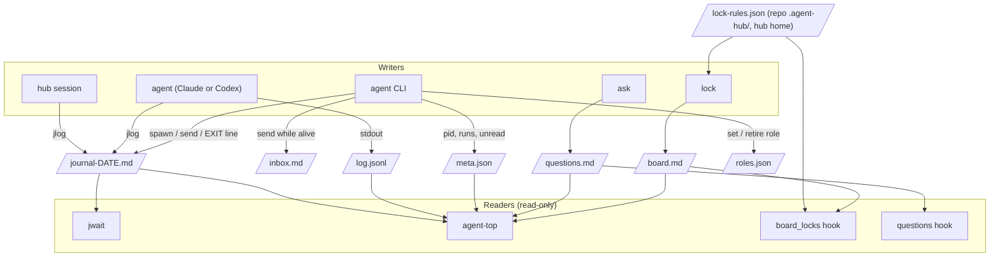

# Architecture and file formats

## Roles

- **Owner** — the human. Decides product, money and anything that leaves the team; answers questions in chat.
- **Hub** — one interactive Claude Code or Codex session per stage and shift (`hub-<N>`; the number is derived from `roles.json`
  and the latest handoff). A **stage** is one stream of work with its own directory under the hub home. The hub plans,
  writes briefs, spawns and answers agents, records questions and decisions. It keeps its own context small: tool output
  goes to agents.
- **Agents** — detached `claude -p` or `codex exec` sessions (`agent spawn`), one per long task, tagged `hub-<N>-<role>`. They work in
  their own checkout (`--worktree` makes one) and talk only through files.
- **Other sessions** (optional) — interactive sessions with a role in `roles.json` (a session that does the merges, a
  second hub of another stage). They are messaged with SendMessage (on Claude Desktop within the send budget), or
  through the journal.

## Who writes what



## Where the hub home is

`hubcore.home()` resolves it, most specific first: `$AGENT_HUB_HOME` (any path); a repository's
`.agent-hub/config.json` key `AGENT_HUB_HOME`, only `"project"` (`<main checkout>/.agent-hub/local/`, shared by the
repository's worktrees) or `"user"`; the user default `~/agent-hub`; and, while `~/agent-hub` does not exist and
`~/.claude/agent-hub` does, that legacy home with a warning (`.claude` is protected by Claude Code, see
[Home resolution](reference.md#where-the-hubs-files-live)). Tools resolve it for their working directory; hooks for the session's directory, the hook
input's `cwd` (`hubcore.use_cwd`). Children never resolve on their own: `agent spawn`, a resume, the autopilot
successor and the headless successor get `AGENT_HUB_HOME=<the parent's resolved home>`, plus `--add-dir <home>` when
the home is not under their directory. A stage that exists in `~/agent-hub` or the legacy home but not in the resolved
one is refused (`check_stage`), since a stage split across two homes loses half its journal.

## Hub shift handover

```mermaid
sequenceDiagram
    participant Old as Hub #2
    participant F as Files
    participant New as Hub #3
    Old->>F: hub handoff --stage stage-a → HANDOFF-hub-stage-a-DATE.md (fill TODOs)
    Note over Old: session ends; agents keep running
    New->>F: hub takeover --stage stage-a --session ID (number = registered hub + 1)
    F-->>New: locks moved, roles hub, start line (and the night queue's coordinator line, if the stage has one)
    F-->>New: digest: handoff § 0, ask register, locks, roles, first jwait --since HANDOFF_TIME
    New->>F: jwait … --since HANDOFF_TIME (lines written during the handover are delivered)
```

The very first hub of a stage has no predecessor: `hub start --stage S --session ID` creates `<hub home>/S/`, registers
`hub-1`, writes the start line and prints the first `jwait`. `--n` on `takeover` and `handoff` overrides the derived
number; a re-run of a takeover finds itself registered and keeps its number.

Both commands first check where the hub runs: in a linked worktree of its project that has `.agent-hub/`. The main clone
or a directory outside git gets a fresh worktree `<repo>/.claude/worktrees/<stage>-hub-<n>` from origin's default branch and
exit 4 with `MOVE <path>`; nothing is registered until the re-run from there (`<hub home>/S/stage.json` remembers the
project; [Reference](reference.md#file-layout)). A previous hub that is a background session and not busy is stopped by
the takeover (`claude stop`, history kept); a busy one or a Desktop session is only named.

## Lock rules and the hook

A lock is on a named **resource**. `bin/lockrules.py` is the one module that knows what resources a project has; the
`board_locks` hook (which decides) and the `lock` CLI (`take` checks a name, `lock rules` shows and edits) both import
it, so what `lock take` accepts and what the hook enforces cannot drift apart. Python standard library only: the
PreToolUse hook imports it on every Bash call.

- **Built in:** `main-merge` — merges into, and pushes to, the protected branches (`main`, `master` unless configured).
- **From the project:** every other resource comes from `lock-rules.json`, read from `<repo>/.agent-hub/` (the
  repository the command runs in) and `<hub home>/` (or `$AGENT_HUB_LOCK_RULES`); rules of both apply, the repository's
  first, and the first matching rule wins. `"resources": {name: description}` is optional; when present, every rule's
  `kinds` must be declared there or be `main-merge`. A resource with no rule is informational.
- **Names:** lowercase letters, digits and hyphens. `lock take` refuses an unconfigured name and lists the known ones,
  except for a name already on the board (a handover); `lock release` accepts any name; board records of any kind keep
  parsing.
- **Checking:** `lock rules check "<command>"` runs the real hook against a scratch board where every resource is held
  by someone else, so a rule is tested without touching the real board.
- **Failure mode:** a lock-rules file that cannot be used is skipped with a warning on every command; the built-in
  rules and the other file keep guarding. Any error of the hook itself lets the command through (fail-open).

## Hook scope

| Hook | Event | Acts |
|---|---|---|
| `board_locks` | PreToolUse, Bash | In every session on the machine, but only on merges and pushes to protected branches and on commands a `lock-rules.json` names. |
| `handoff_size` | PreToolUse, Write or Edit of `HANDOFF-*.md` | Only in the hub home, in a repository with `.agent-hub/`, or under a directory of `AGENT_HUB_SCOPE_DIRS`. |
| `questions` | SessionStart | The same places, and in hub agents (`HUB_TAG` set by `agent spawn`). |

`AGENT_HUB_SCOPE_DIRS` is a hub-wide setting (directories separated by `:`; the hub home's `config.json` or the
environment, never a repository's). A session in an unrelated project hears nothing from the last two.

## Agent worktrees

`agent spawn --worktree [BRANCH]` (default `agent/<role>`) resolves the agent's working directory in this order: an
existing worktree of that branch, wherever it is, is reused (a re-spawn continues the work); else
`<main repository>/.worktrees/<branch>` is created from origin's default branch (`--base REF` chooses another start;
`--base HEAD` is the commit checked out in `--cwd`), and `/.worktrees/` is added
to `.git/info/exclude`, so the main checkout shows nothing untracked. Spawning from inside a worktree still lands in the
main repository's `.worktrees/`. A branch checked out in the main checkout, a bad branch name and a foreign directory at
the path are refused. `meta.json` records the worktree; `agent status` and `agent stop` name it. Nothing removes it: the
hub lists worktrees in the handoff and runs `git worktree remove <path>` once the branch is merged.

## Formats

**Journal line** — `- HH:MM [tag] text`, one per event, in `<stage>/coordinator/work/journal-YYYY-MM-DD.md`.
Status words the hub waits for: `MERGED`, `STOP`, `DONE`, `BLOCKED`, `EXIT`, `QUESTION`; a script waiting for input
prints `AWAITING ANSWER`. `@tag` addresses a line to a role. A tag `T/sub` is a sub-tag of `T`: the caller's own tag
and its sub-tags never wake its own `jwait`.

**Question register entry** (`questions.md`, kept by `ask`):

```markdown
## Q-A-001 — Turn the new export on by default?
- kind: question
- status: open            (open | default-taken: DATE | answered: TEXT (DATE HH:MM) | withdrawn: TEXT (DATE))
- asked: 2026-09-30 10:20
- by: hub-3
- due: 2026-10-01T18:00
- blocks: PR 41
- default: ship with the flag off
- source: not set
- done: 2026-10-01 12:10 — flag flipped in PR 43     (after the answer is executed; repeatable)
```

`D-…` entries (`ask decided`) record a decision an agent took itself, with `alternative:` and status `standing`.

**Lock record** (`board.md`, inside a fenced `locks` block, one JSON object per line):
`{"kind": "main-merge", "repo": "webapp", "owner_name": "Hub stage-a #3", "session_id": "…", "until": "…", "why": "…"}`.
`kind` is `main-merge` or a resource named in `lock-rules.json` (see above); a record of any kind still parses, even
one that no rule names any more. `repo` `"*"` guards every repo.

**Night queue item** (`night-queue.md`; an optional module for macOS with Claude Desktop):
`- [ ] action | stop: condition | class: local|dev|stage|main|prod [| yes: DATE "owner quote"]`; `prod` needs `yes:`.

**Agent meta** (`agents/<role>/meta.json`): role, tag, stage, session_id, model, effort, permission_mode, cwd, brief,
report, worktree (path, branch; with `--worktree`), runs (`pid`, `at`, `kind` spawn/resume; written as soon as the run's process exists), pid, inbox_unread. An agent is alive when its pid is alive **and**
that process's command line contains its session id (guards against pid reuse). The prompt of the latest run is
`prompt.txt` beside it: the CLI reads it on stdin, so no brief text is in any command line.
