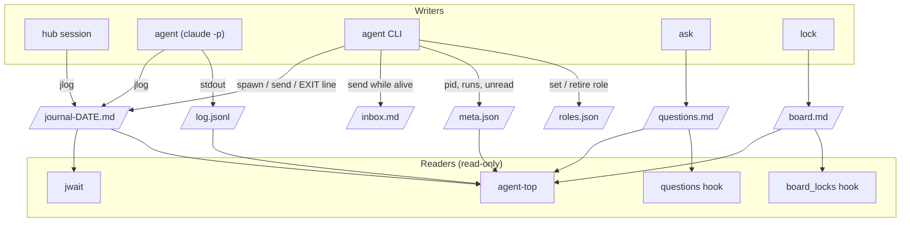

# Architecture and file formats

## Roles

- **Owner** — the human. Decides product, money and anything that leaves the team; answers questions in chat.
- **Hub** — one interactive Claude Code session per stage and shift (`hub-<N>`). Plans, writes briefs, spawns and
  answers agents, records questions and decisions. Keeps its own context small: tool output goes to agents.
- **Agents** — headless `claude -p` sessions (`agent spawn`), one per long task, tagged `hub-<N>-<role>`. They work in
  their own repository checkout and talk only through files.
- **Other sessions** (optional) — interactive sessions with a role in `roles.json` (a release steward, a second hub
  of another stage). They are messaged with SendMessage within the send budget, or through the journal.

## Who writes what



## Hub shift handover

```mermaid
sequenceDiagram
    participant Old as Hub #2
    participant F as Files
    participant New as Hub #3
    Old->>F: hub handoff --stage stage-a --n 2 → HANDOFF-hub-stage-a-DATE.md (fill TODOs)
    Note over Old: session ends; agents keep running
    New->>F: hub takeover --stage stage-a --n 3 --session ID
    F-->>New: locks moved, night-queue coordinator, roles hub, start line
    F-->>New: digest: handoff § 0, ask register, locks, roles, first jwait --since HANDOFF_TIME
    New->>F: jwait … --since HANDOFF_TIME (lines written during the handover are delivered)
```

## Formats

**Journal line** — `- HH:MM [tag] text`, one per event, in `<stage>/coordinator/work/journal-YYYY-MM-DD.md`.
Status words the hub waits for: `MERGED`, `STOP`, `DONE`, `BLOCKED`, `EXIT`, `QUESTION`; a script waiting for input
prints `AWAITING ANSWER`. `@tag` addresses a line to a role. A tag `T/sub` is a sub-tag of `T`: the caller's own tag
and its sub-tags never wake its own `jwait`.

**Question register entry** (`questions.md`, kept by `ask`):

```markdown
## Q-A-001 — Turn the new export on by default?
- kind: question
- status: open            (open | default-taken: DATE | answered: TEXT (DATE HH:MM) | withdrawn: TEXT (DATE))
- asked: 2026-09-30 10:20
- by: hub-3
- due: 2026-10-01T18:00
- blocks: PR 41
- default: ship with the flag off
- source: not set
- done: 2026-10-01 12:10 — flag flipped in PR 43     (after the answer is executed; repeatable)
```

`D-…` entries (`ask decided`) record a decision an agent took itself, with `alternative:` and status `standing`.

**Lock record** (`board.md`, inside a fenced `locks` block, one JSON object per line):
`{"kind": "main-merge", "repo": "webapp", "owner_name": "Hub stage-a #3", "session_id": "…", "until": "…", "why": "…"}`.
Kinds: `deploy-window`, `main-merge`, `stage`, `migration-head` (informational). `repo` `"*"` guards every repo.

**Night queue item** (`night-queue.md`):
`- [ ] action | stop: condition | class: local|dev|stage|main|prod [| yes: DATE "owner quote"]`; `prod` needs `yes:`.

**Agent meta** (`agents/<role>/meta.json`): role, tag, stage, session_id, model, effort, permission_mode, cwd, brief,
report, runs (`pid`, `at`, `kind` spawn/resume), pid, inbox_unread. An agent is alive when its pid is alive **and**
that process's command line contains its session id (guards against pid reuse).
