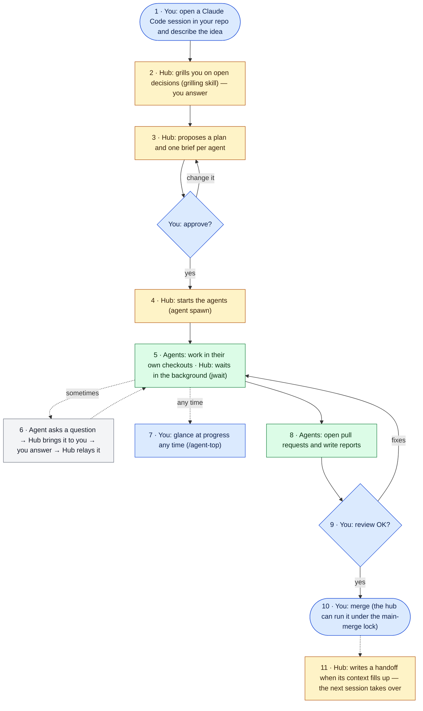

# Getting started: from idea to shipped

This page follows one idea from the first sentence you type to merged code. It is about what **you** say and do, what
the **hub** does on its own, and what the **agents** do. It is not a command reference: for that, see
[a-day-with-agent-hub.md](a-day-with-agent-hub.md) (every command, in order) and [architecture.md](architecture.md)
(file formats).

The running example, used in every step: *"add CSV export to the reports page of my web app"*, with three agents
named `api`, `ui` and `tests`. Everything below is synthetic.

Three words used throughout. The **hub** is your interactive Claude Code session: it plans and coordinates but does not
do the long work. **Agents** are headless `claude -p` sessions that do it, one per task. A **stage** is one stream of work
(here, this feature) with its own directory of files under the hub home (`~/agent-hub/<stage>/`).

## The flow in one picture



Read it top to bottom. Colour says who acts: **blue — you**, **yellow — the hub** (your chat session), **green — the agents** (headless, they keep running when you close the chat), grey — a round trip between all three. Dotted arrows are things that happen now and then. The numbers match the steps below.

## Install and set up, once

Platform: macOS or Linux (Windows is not supported; see the [README](../README.md#install)).

```text
/plugin marketplace add ilya-kozyrev/claude-agent-hub
/plugin install agent-hub@claude-agent-hub
```

Requirements and the permissions note are in the [README](../README.md#install). Read the permissions note before your
first agent: headless agents run with `bypassPermissions` by default.

Then, in the checkout of each repository you will use with the hub, ask Claude to use the **`agent-hub:setup`** skill
(a new, empty project: see [A new, empty project](#a-new-empty-project)). The skill asks which branches are
protected, whether the project has environments or other resources that two sessions must not change at once (staging,
a deploy window, a migration chain), and which commands touch each; writes `.agent-hub/lock-rules.json` and
`config.json`; and proves the rules with `lock rules check`. A project with no deployment ends with `main-merge` only,
which is a complete setup. Commit `.agent-hub/`.

### Where the hub keeps its files

The hub keeps its files (journals, inboxes, the question register, the lock board, handoffs) in `~/agent-hub`, a plain
directory that `hub start` creates. It is not under `~/.claude`: Claude Code protects that directory, so every write
there would prompt, and under `/sandbox` the tools could not write at all. Writes outside a session's own directories
prompt too, so grant the hub home once: `/add-dir ~/agent-hub` in the session, or for every session add it to
`~/.claude/settings.json`:

```json
{"permissions": {"additionalDirectories": ["<home>"]}}
```

`hub home` prints where the files are, why there, and these lines with your path filled in. Agents the hub starts, and
its autopilot successor, get the grant from the tools. To keep the files inside the repository instead, put
`{"AGENT_HUB_HOME": "project"}` in `.agent-hub/config.json` (`agent-hub:setup` asks; `git clean -fdx` deletes that
folder). An installation made with 0.6 or earlier keeps its files in the legacy `~/.claude/agent-hub` until you run
`hub home migrate` (a dry run; then `--apply`). The full story is in the README:
[Where the hub's files live](../README.md#where-the-hubs-files-live).

### Start small

You do not need every tool on day one. One hub and a few agents need three: **`agent`** (spawn, status, send, stop),
**`jlog`** and **`jwait`**. `roles`, `ask`, `lock`, `hub takeover` and `hub handoff` start to matter when you have more
than one interactive session, more than one shift, or a shared resource. The walkthrough below uses them in the order
they come up; skip what you do not need yet. The night queue and the night nudge are optional modules for macOS with
Claude Desktop and do not appear here.

A small change the hub may make itself; say "through agents" if you want otherwise. The hub does not ask you how to run
the work (agents or not, worktrees, commits): it decides, says so in one line and records the decision.

### A new, empty project

A new, empty project may skip `agent-hub:setup` for now: the hub offers it when it is needed. A repository with no
commits cannot start an agent in a worktree (`agent spawn --worktree` refuses it), so the hub makes the first commit
itself and says so in one line.

## Step by step

### 1. Open a session in your repo and describe the idea

Start Claude Code in the repository you want to change (this chat becomes the **hub**) and say what you want, plainly.
Start the message with `/agent-hub:hub`: the slash command always loads the skill, while a plain-language mention of it
may be ignored by a smaller model, which then plans and codes on its own.

```text
/agent-hub:hub I want CSV export on the reports page of this web app: a button that downloads
the table as CSV, filtered the same way as the table. Plan it as one stage called csv-export. Don't start
anything before I approve the plan.
```

- **Hub:** loads the `hub` skill (the workflow and the tool list) and starts the stage:
  `hub start --stage csv-export --session "$CLAUDE_CODE_SESSION_ID"`. That creates the stage directory, registers this
  session as `hub-1`, writes the start line to the journal and prints the first `jwait` command. (If you skipped the setup
  above and the repository has no `.agent-hub/`, the hub offers the `agent-hub:setup` skill first.)
- **You see:** the stage start line (hub tag `hub-1`, "started stage csv-export") and a first round of questions
  Q1, Q2 …, each with a recommendation. If they are missing, the skill did not load: start the message with
  `/agent-hub:hub`.
- **Wait:** seconds.
- **Next:** answer its questions.

### 2. Answer the clarifying questions

The hub first looks for decisions you already made (`ask search csv export`; the register is empty on day one), then
**grills** you on the rest with the `grilling` skill (install it once — see
[Recommended companion](../README.md#recommended-companion-grilling)): rounds of numbered questions, each with its
recommended answer, so most answers are "yes" or one sentence. Facts it can find in the code it looks up itself.

```text
Hub: Q1 — Which columns go into the file?
     → Recommended: only the visible ones, in table order.
     Q2 — New endpoint, or a format option on GET /api/reports (the table's only data source)?
     → Recommended: a format=csv option on the existing endpoint.
You: 1 yes. 2 yes.
```

- **Hub:** reads the repo, grills in rounds until nothing is left assumed, and records every answer in the register
  (`ask add` + `ask close`; it lands in `questions.md`), so no later hub or agent asks it again. Anything you cannot
  decide now becomes an open question with a default action and a due time.
- **Wait:** a few minutes of conversation.
- **Next:** the plan.

### 3. Review the plan and the briefs

The hub proposes the split before it starts anything: which agents (`api`, `ui`, `tests`), what each one owns, which
paths each must not touch, how each one proves it is done, and its stop condition ("open a PR and stop; do not merge").

- **Hub:** drafts one **brief** per agent from the short `templates/brief-executor-template.md`: why, decisions already
  made (filled from the register), steps with a checkable "done", verification, and where to stop, with a turn limit.
  It shows you the plan, and the brief files are on disk to read.
- **You see:** a plan of a screen or two.
- **Wait:** minutes.
- **Next:** approve, or say what to change. The plugin has no approval button; you approve by saying so in chat, and
  you told the hub in step 1 to wait.

```text
Plan is fine, but tests must not touch the existing fixtures, and ui should reuse our button component.
Go.
```

### 4. The hub starts the agents

- **Hub:** runs one `agent spawn` per brief, for example
  `agent spawn --role api --tag hub-1-api --cwd <repo> --worktree --model sonnet --brief <brief file>`. Each agent is a
  detached `claude -p` session with its own process and session id. `--worktree` gives it its own git worktree (branch
  `agent/api`, directory `<repo>/.worktrees/agent/api`, kept out of git status), so two agents never edit the same
  files. Nothing removes a worktree afterwards; once the branch is merged, `git worktree remove <path>`.
- **Files that appear:** `agents/<role>/{brief.md, inbox.md, log.jsonl, meta.json}` and the first lines in today's
  journal, `coordinator/work/journal-YYYY-MM-DD.md`.
- **You see:** one "started" line per agent.
- **Wait:** the run starts within seconds.
- **Next:** nothing. The hub now waits.

### 5. The hub waits, and so can you

- **Hub:** starts one background `jwait` that wakes it when a `DONE`, `BLOCKED`, `EXIT` or `QUESTION` line addressed to
  it appears. No polling, no `sleep` loops.
  The hub must be an interactive session (Claude Desktop or a terminal session): there its background `jwait` wakes
  it. A hub run as `claude -p` has its background `jwait` killed when the turn ends and learns about `DONE` only from
  its next message.
- **Agents:** work, commit often, and write to the journal only on events. They read their inbox after every major
  step.
- **You:** do something else. Closing the chat does not stop agents (see [When you are not needed](#when-you-are-not-needed)).
- **Wait:** from a few minutes to a few hours, depending on the task.

### 6. Answer an agent's question

An agent that needs a decision writes `@hub QUESTION …` and ends its turn with `BLOCKED`. The hub wakes up.

- **Hub:** checks the register first. If you already decided the matter, it applies the answer with `agent send` and
  never bothers you. If not, it asks you in chat, registers the question (`ask add --default … --due …`) and tells the
  agent what to assume meanwhile.
- **You see:** one question, with the default action and the deadline.
- **You do:** answer in a sentence.
- **Hub, then:** `ask close` with your answer, `agent send <role> "…"` (a finished agent resumes with the message),
  and later `ask done` with evidence that it was carried out.
- **Wait:** the agent continues within seconds of the message.

If you do not answer by the due time, the default action is taken and the question stays open until you answer.

### 7. Glance at progress

```text
/agent-top
```

- **Tool:** the `agent-top` skill builds a snapshot of every agent: live or done, task, current action, unread
  messages, locks, open owner questions, plan limits. Read-only.
- **You see:** a widget in chat, or the same as text if the widget tool is missing. In the desktop Code tab the widget
  has no buttons; it names the commands to type.
- **Zoom in:** `/agent-top api` shows one agent's task, last thought and result.
- In a terminal, `agent-top` is a live console, and `agent-top --once` prints a text snapshot.

### 8. Agents open pull requests

When an agent finishes, it writes its report to `coordinator/work/<tag>-REPORT.md`, journals
`DONE <report path>` and exits. If your briefs said "open a PR and stop", the PRs are open now.

- **Hub:** reads the one-line `DONE`, not the whole log, and tells you what is ready.
- **You see:** "api: PR 41 open, tests green. ui: PR 42 open." with the report paths.
- **Next:** review.

### 9. Review

Review is your call; the plugin does not require any. A common pattern: the hub asks `hub reviewer --for code` which
reviewer to use — by default an ordinary `agent spawn`, a different model from the author — and starts it with a brief
that names the PRs and the criteria (`templates/brief-review.md`; reviewers and how to plug in your own:
[reviewers.md](reviewers.md)). The hub's rule of thumb is at most three review rounds per artifact; after that only
blockers with a concrete scenario are accepted.

```text
Have a reviewer agent check PR 41 and 42 against the brief. Report only real problems.
```

- **You see:** a short verdict per PR, or a fix round: the hub sends the author `agent send api "…"` and waits again.
- **Next:** when you are satisfied, merge.

### 10. Merge

Merging to main is the one step the plugin guards on its own. A lock, `main-merge`, says who may merge right now, and a
hook refuses `gh pr merge`, `glab mr merge` and a `git push` to a protected branch while *another* session holds the
lock. Any other resource you named in `agent-hub:setup` works the same way.

```text
Merge 41, then 42. Take the main-merge lock first so nobody else merges meanwhile.
```

- **Hub:** `lock take main-merge --repo webapp --until +2h --why "csv-export"`, merges, `lock release`.
- **You see:** the merge result and the lock released.
- **Note:** merging is not shipping. Deploying is whatever your project does after a merge; the plugin has no deploy
  step (it can guard one if you name the resource and list your deploy command in `lock-rules.json`).

### 11. Hand over when the context fills up

A long stage outlives one chat. When the hub's context is long, or at the end of the day, it loads the `handoff` skill:

```text
Context is getting long. Write the handoff.
```

- **Hub:** `hub handoff --stage csv-export` writes `HANDOFF-hub-csv-export-<date>.md` with locks, agents and the
  question register filled in; the hub fills the rest (first steps, queue, risks, worktrees to clean up) and tells you
  the path. It releases no locks. Agents keep running.
- **Next session:** open a fresh chat in the repo and say
  `/agent-hub:hub take over stage csv-export from <the handoff path>.` The new hub runs
  `hub takeover --stage csv-export --session "$CLAUDE_CODE_SESSION_ID"`, which takes over the locks, registers itself as
  the next hub (`hub-2`: the number is derived from the registry; `--n` overrides it), and prints a digest of the
  handoff, the register and the live agents.

## A sketch of a real session

Synthetic. Lines starting with `#` are annotations, not part of the chat.

```text
You:  /agent-hub:hub Add CSV export to the reports page. One stage, csv-export. Plan first, start nothing.
# the hub loads the skill and reads the repo
Hub:  No earlier decisions on "csv export" in the register. Grilling, round 1:
      Q1 Which columns? → recommended: visible ones, table order.
      Q2 New endpoint or format=csv on GET /api/reports? → recommended: the option on the existing endpoint.
You:  1 yes, 2 yes.
# the hub records both answers with ask add + ask close; no round 2 is needed
Hub:  Plan: api (endpoint option + streaming), ui (button, reuse ButtonLink), tests (API and UI tests, no
      fixture changes). Each opens one PR and stops; none merges. Briefs are in work/brief-{api,ui,tests}.md.
      Open question for you, not blocking: should large exports (> 50k rows) be refused or truncated?
      Default if you do not answer by 18:00: refuse with a clear error. Registered as Q-EXPORT-001.
You:  Fine. Start.
# the hub runs agent spawn three times; three "started headless agent" lines appear in the journal
Hub:  Started api, ui, tests, each in its own worktree (tags hub-1-api, hub-1-ui, hub-1-tests). I am waiting in
      the background; I will only speak when something finishes or blocks.
# 40 minutes pass; the hub is woken by a journal line
Hub:  ui asks: the reports table has a "Select all" column; export it or skip it? I found no earlier decision.
      Default if you do not answer: skip it. Asked as Q-EXPORT-002.
You:  Skip it.
# the hub runs ask close Q-EXPORT-002, agent send ui "Q-EXPORT-002: skip the select-all column", ask done later
You:  /agent-top
```

And what `/agent-top` shows later that afternoon, as text (`agent-top --once`):

```text
 agent-top ● 1 ✓ 2 csv-export · locks 0 · questions 1 (overdue 0) · limit 5h 27% 7d 41%                       15:20:11
  ROLE   TASK                           STATUS MODEL           AGE TURN  CTX     $ ✉  NOW / LAST
● ui     Add the CSV button to the rep… live   sonnet-5-5/hi    0s   18  71k     —    ▸ Bash: gh pr create --title "Add C…
✓ api    Add format=csv to GET /api/re… done   sonnet-5-5/hi   32m   41  88k $2.10    DONE PR 41 open, report at wor…
✓ tests  Write API and UI tests for t… done   sonnet-5-5/hi   12m   29  64k $1.35    DONE PR 43 open, report at wor…

Owner questions (ask summary)
  csv-export — open 1, overdue 0
    Q-EXPORT-001 [csv-export] open — Refuse or truncate exports over 50k rows?
    blocks: nothing; default by 2026-10-01T18:00: refuse with a clear error

Journal (last 5 lines):
14:48 [hub-1-api] DONE PR 41 open, report at work/hub-1-api-REPORT.md
14:59 [hub-1-tests] DONE PR 43 open, report at work/hub-1-tests-REPORT.md
15:08 [hub-1] @hub-1-ui Q-EXPORT-002: skip the select-all column
15:12 [hub-1-ui] export button wired to the new endpoint; running UI tests
15:18 [hub-1-ui] UI tests green; opening the PR
```

Two agents are done, one is finishing its tests, and you are asked for nothing except the one non-blocking question.

## Leave the hub running

To walk away while a stage runs, turn on autopilot once, in the hub home's `config.json`
(`~/agent-hub/config.json`):

```json
{"AGENT_HUB_AUTO_HANDOFF": "on"}
```

Before you rely on it, check three things in a terminal: `claude auth status` says `"loggedIn": true` (else
`claude auth login` — Claude Desktop's login does not count), `claude` has been run once in the project directory and
its trust prompt accepted, and — only if your hub runs in bypass mode — `claude --dangerously-skip-permissions` has
been accepted once.

When the hub's context reaches the warn threshold (300k tokens), it writes the handoff at its next quiet point and
starts its successor as a background session named `<stage>-hub-<n>`. The journal gets one line with its Remote
Control link and `claude attach <id>`, and the old hub tells you the same in one line before it stops. To reach the
successor:

- **Phone or browser:** open the link, or find the session by name in the Claude app's Code section (Remote Control).
- **Terminal:** `claude attach <id>`; `claude agents` lists background sessions.

If the background session cannot start (the CLI is not logged in, the directory is not trusted) or does not take over
in 10 minutes, the successor is a headless hub instead: ask it things with `agent send hub-<n> "…"` and read its
answers in the journal and `ask list`. After 10 automatic handoffs in a row (`AGENT_HUB_AUTO_HANDOFF_CHAIN`) the hub
writes its handoff and waits for you; anything you type to the hub resets that count.

## When you are needed

- **Approve the plan and the briefs**, before any agent starts. This is the cheapest moment to change direction.
- **Answer questions** that touch product, money or anything that leaves your team. The hub brings them one at a time,
  with a default.
- **Review and merge.** The hub can run the merge, but the decision to merge is yours.
- **Permissions.** Agents run with `bypassPermissions` by default. You decide what they must not touch (in the brief),
  and whether to run them in a worktree or sandbox instead of your main checkout.

## When you are not needed

- **Waiting.** The hub waits with one background `jwait`; it needs no prompting and does not poll.
- **Closing the chat.** Agents are detached `claude -p` processes in their own process group; they survive the hub
  session. Their output goes to the journal and report files. Open a new chat later, load the `hub` skill, and the hub
  reads them (a handoff makes this cleaner).
- **Repeated questions.** The register means the hub does not ask you what you already answered, in this session or the
  next.
- **Routine progress.** Agents write to the journal only on events, so you are not shown running commentary.

## Common first-day mistakes

- **Agents with a loose brief.** A headless agent has nobody to ask in chat and no end unless the brief gives one. Every
  brief needs a "done" you can check, a stop condition ("open a PR and stop"), a turn limit and a list of what not to
  touch. The template exists for this. The limit matters for cost too: every turn re-reads the agent's whole context, so
  a long agent costs more than its turn count suggests and draws on the same plan limits as your own chat
  ([cost and turn limits](../README.md#cost-and-turn-limits)).
- **Ignoring the permissions mode.** `bypassPermissions` is the default because any other mode silently stalls on the
  first blocked tool. Run agents in their own worktree, say what they must not touch, or set
  `AGENT_HUB_PERMISSION_MODE` (for example `acceptEdits`) and accept that some tools will be refused. The hub needs
  bypass too: in `default` and `acceptEdits` it waits for your click on every tool call, and in `auto` the classifier
  refuses merges and pushes, so an unattended hub stops (README § Install, "Run the hub in bypass mode").
- **Long waits in the foreground.** A hub that sits in `sleep` or a polling loop fills its context and blocks the chat.
  The waiting tool is `jwait`, run in the background. Agents are the same in reverse: they end when their turn ends, so
  a long command is run in the foreground with a raised timeout, not left in the background.
- **Expecting buttons in the widget.** In the Claude Code desktop tab the `/agent-top` widget cannot send prompts. Type
  the command it names, such as `agent send api "…"`.
- **Two agents in one checkout.** They overwrite each other. Start every agent that writes code with `--worktree`.
- **Letting the hub run until it forgets.** Write the handoff while context is left, not after the chat has slowed
  down. Agents keep running meanwhile, and the next hub picks up from the file.

## Where next

- [a-day-with-agent-hub.md](a-day-with-agent-hub.md): the same flow at command level, with a night queue.
- [architecture.md](architecture.md): roles, who writes which file, and the file formats.
- [README](../README.md): how the hub compares with Claude Code's own sub-agents and background sessions, team use,
  configuration variables and limitations.
