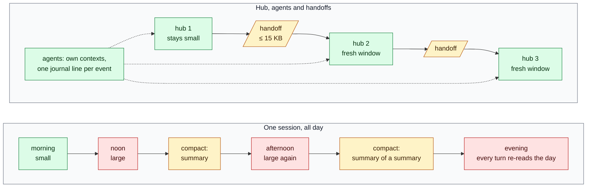

# Why a hub and headless agents

This page explains why agent-hub splits long work between one hub session and headless agents, why Claude Code's
subagents are not enough for that on their own, and why a written handoff beats `/compact` for work that outlives one
session. The numbers come from one project that ran several multi-week stages this way. Claude Code behaviour is
quoted from the official docs, listed under [Sources](#sources).

## The problem in numbers

Claude Code sends your full conversation with every request, and every batch of tool results is another request
carrying all of it. Prompt caching makes the repeated part cheaper, but a one-line question in a session that has been
open all day still draws usage for the whole conversation [1]. After a break longer than the cache lifetime (an hour on
a subscription) the next message reprocesses the full context at the uncached rate [1]. And performance degrades as the
context fills: the model starts forgetting earlier instructions and making more mistakes [2].

Two things follow:

- **Cost grows faster than the work.** If each turn adds about the same amount of output, turn *n* re-reads *n* times
  that amount, so the total read over a session grows with the square of its length. The most expensive shape of work
  is one very long session.
- **Cheap steps become expensive.** Polling a pipeline, reading a log, answering "nothing new" — each costs as much
  context as the whole history behind it.

What that looked like in practice:

| Observation | Number |
|---|---|
| Agent machine time in a three-day stage spent in foreground `until …; do sleep …; done` loops | 9.2 h of 24.0 h (590 calls) |
| … plus foreground waiting for CI | 4.0 h |
| Waits that hit the 10-minute Bash ceiling | 29 calls, 4.8 h |
| Waits on `pgrep -f` that matched their own shell and never ended | 68 calls |
| One-off "is the pipeline done yet?" calls in a later multi-week stage, after loops were banned | 573 calls, 808 turns (16 % of all turns) |
| Context each of those polling turns re-read | 300–600k tokens, roughly 0.24–0.48 billion tokens to learn "not yet" |
| One hub session kept alive for a stage | 1,859 messages on the top model; that model's weekly cap stood at 39 % against 30 % overall |
| One executor that was not cut into stages | 1,100 turns; the overnight run stretched to nine hours |

None of this came from a hard task. It came from one session doing planning, waiting, log reading and coordination in
the same context, so every cheap step paid for the whole history. The fixes are plain: keep the coordinating context
small, run heavy and long work in separate sessions, wait in the background instead of polling, and start a fresh
session from a short written state instead of dragging the old one along. agent-hub is those fixes as files and small
CLIs.

## Why not let one session launch many subagents

Claude Code's subagents are good at what they are for. Each runs in its own context window and only its result comes
back, so verbose output stays out of your conversation; the docs recommend exactly this for tests, docs and logs
[1][3]. They can run in the background, and a finished one can be resumed with `SendMessage` [3]. They also spend the
same usage limits as your main conversation [3].

The limit is in the first line of their docs: subagents work within a single session [3].

| | In-session subagent | Headless agent (`agent spawn`) |
|---|---|---|
| What it is | A worker inside one session [3] | A separate `claude -p` process with a fixed `--session-id`, detached from the hub [6][7] |
| Lifetime | Belongs to the session that started it; resumable by resuming that session [3] | Its own process; runs on when the hub closes, compacts or hands over |
| Where results land | In the parent's context: the final message, or for a background one a completion notification in a later turn [3] | One journal line (`DONE <report path>`); the full report is a file the hub opens only if it needs to |
| Who can reach it | The conversation that spawned it [3][5] | Any session or person: `agent send` appends to its inbox while it runs and resumes it with `claude --resume <id> -p` after it exits [6] |
| Visibility | `/tasks` in that session [5] | `agent-top` and the journal, for every agent, from any terminal |
| After a handoff | The new hub is a different session; the subagent stays with the old one [3] | Same role, session id and inbox; `hub takeover` hands it to the next hub |
| Decisions it relies on | Whatever the parent put in its prompt | The brief, with "owner decisions — do not reopen" filled from the question register |
| Cost shape | Cheap to start; each report grows the parent | A brief to write; the hub grows by one line per event |

Use an **in-session subagent** for short, bounded pieces while you are there: a search, reading a long log for the one
failing line, a fact check, a review of one file. The hub does this itself — a hub that reads logs in its own context
is the pattern this plugin exists to avoid.

Use a **headless agent** when the work runs longer than about half an hour, must outlive the session that started it,
or other sessions must be able to reach it: a stage executor, an agent that merges approved PRs one at a time, a
release rehearsal, a night queue. The full decision table, background sub-agents included, with the measurements
behind it: [launch-modes.md](launch-modes.md).

Claude Code also has agent view (background sessions you dispatch and watch from one screen, research preview), agent
teams (a lead and teammates that message each other, experimental) and cross-session messaging [4][5]. If one of them
covers your case, use it. agent-hub sits on plain `claude -p` and adds what those do not keep for you as files: a
journal any session can wait on, an owner-question register, a lock board with a hook, and a handoff that lets the
hub itself be replaced every few hours.

## Why a handoff when there is `/compact`

`/compact` replaces the conversation with a structured summary inside the same session; auto-compact does the same
when the conversation nears the auto-compact window — on Sonnet 5.5, about 967K of its 1M tokens by default
[1][2][8]. The summary keeps your requests, key concepts, files, errors and pending tasks; full tool outputs and
intermediate reasoning are gone, and Claude "won't have the exact content" of the rest [2]. For a session that will
finish soon this is fine: it frees room and you carry on.

For a hub that runs for days it has four problems:

- **You do not choose what survives.** The summary is the model's paraphrase. An owner decision with its exact wording,
  a session id, a lock you hold, an item marked "do not reopen" can be shortened or dropped, and nothing tells you
  which. `/compact <instructions>` steers it, but it is still a paraphrase [1].
- **It compounds.** The next compaction summarises a summary. In the project above, questions asked in one hub
  shift quietly became "we no longer ask this" a few shifts later; hubs rotated every 6–12 hours.
- **Nobody else can read it.** The summary lives in one transcript. A person cannot review it, another session cannot
  pick it up, and a mistake in it stays invisible until it causes one.
- **It comes late and costs a full read.** Auto-compact fires near the limit, when the context is least sharp, and
  compacting a large context is itself a large request [1]. The session then keeps paying for the summary on every turn.

A **handoff** answers each point. It is a file with a fixed structure (`templates/HANDOFF-template.md`):

1. **First steps** — three to six commands, the first always `hub takeover`.
2. **Where things stand** — each fact with where it shows: a command, a file, a URL.
3. **Queue** — by dependency; each item with a "done" check, a stop condition and the model to run it.
4. **Owner questions** — a pointer to the question register, which outlives every session; not a copy.
5. **Risks** — what breaks when nobody watches, and how it shows.

It is size-capped (the `handoff_size` hook refuses a `HANDOFF-*.md` over 15 KB; the skill aims at 12 KB). It is written
at a threshold, not at overflow: the project above warned at 350k tokens of context and refused new delegation at 550k
unless the call was writing a handoff. And the next hub is a fresh session — a full window and cheap turns — that reads
a page instead of inheriting a transcript. The chronology stays in the journal, questions in the register, locks on the
board; the handoff points at them. Facts live in files.

Red is a large context, green a small one, yellow a summary or a file. "One session, all day": one context that only
grows, cut back by summaries nobody reviewed. "Hub, agents and handoffs": each hub stays small, agents carry the heavy
contexts, and what crosses from one hub to the next is a file you can read.

## What the pieces buy you

- **Hub** — keeps decisions and synthesis, not output; tool output and long work go to agents.
- **Journal** — one line per event (`DONE`, `BLOCKED`, `QUESTION`, `EXIT`); the hub sleeps in one background `jwait`
  and wakes on a status word instead of polling. Executors end at the pull request; one waiter watches CI, not each agent.
- **Inbox** — a message to a running agent lands in a file it reads after each step; to a finished one, it resumes it.
- **Question register** — every owner question with a default action and a due time, and every decision an agent took
  on its own, listed for the owner to dispute; no question is asked twice across shifts.
- **Locks** — who may merge main or use a shared environment right now; a hook refuses the command for anyone else.
- **agent-top** — every agent's state, current action, unread inbox, locks and open questions at a glance.
- **Handoff and takeover** — one command to write the state, one to take it over, locks and roles included.

## Costs and when not to use it

- **Briefs are work.** A headless agent knows only its brief. Writing one well — decisions, steps with a done check,
  verification, a stop condition, a turn limit — takes the hub a few minutes, and a vague brief buys a confident report
  of a guess.
- **More sessions spend more.** Running several sessions at once multiplies token usage [5]. Parallel agents finish
  sooner; they cost less only when they replace a long session that keeps re-reading its history.
- **Files are the protocol.** Journals, inboxes and registers are plain text you can read and grep, and just as easy
  to break: the journal is append-only, because rewriting it makes every watcher re-read it from the top.
- **Waits are bounded.** A background Bash command gets 30 minutes by default and at most two hours unless you raise
  `BASH_MAX_TIMEOUT_MS`, and Claude Code stops background tasks, including processes they detached, when it exits
  [9][10]. Give `jwait` a `--for` that fits that limit, and run `agent spawn` as an ordinary foreground call: it
  returns as soon as the agent has written its first event.
- **Small tasks do not need it.** A 30-minute change you watch from start to finish is one session, perhaps with a
  subagent for the search. Use agent-hub when work outlives a session, runs in parallel or has to wait for something.

You can start with three tools: `agent` to start and message agents, `jlog` to write the journal and `jwait` to wait on
it. `roles`, `ask`, `lock`, `nightq` and `hub takeover` start to matter once there is more than one session or more
than one shift.

## Sources

Claude Code documentation, read on 2026-10-01 (Claude Code 2.1.274):

1. [Manage costs effectively](https://code.claude.com/docs/en/costs) — full conversation sent with every request,
   cached re-reads, cache lifetime, "token costs scale with context size", subagents for verbose operations,
   `/compact <instructions>`, compaction as a large request, the auto-compact window.
2. [Best practices](https://code.claude.com/docs/en/best-practices) — performance degrades as the context fills.
   [Context window](https://code.claude.com/docs/en/context-window) — what a compaction summary keeps and drops.
3. [Subagents](https://code.claude.com/docs/en/sub-agents) — own context window, shared usage limits, "work within a
   single session", background completion notifications, resuming with `SendMessage`, transcript persistence.
4. [Agent view](https://code.claude.com/docs/en/agent-view) — background sessions, research preview.
5. [Run agents in parallel](https://code.claude.com/docs/en/agents) — subagents, agent view, agent teams,
   cross-session messaging; who reports to whom; `/tasks`; parallel sessions multiply token usage.
6. [Run Claude Code programmatically](https://code.claude.com/docs/en/headless) — `claude -p`, `--resume`.
7. [CLI reference](https://code.claude.com/docs/en/cli-reference) — `--session-id`, `--resume`.
8. [Model configuration](https://code.claude.com/docs/en/model-config) — 1M-token context windows, the auto-compact
   window and its default.
9. [Interactive mode](https://code.claude.com/docs/en/interactive-mode#how-backgrounding-works) — background commands:
   output to a file, time limits, cleanup at exit.
10. [Tools reference](https://code.claude.com/docs/en/tools-reference) — raising the background command time limit.
